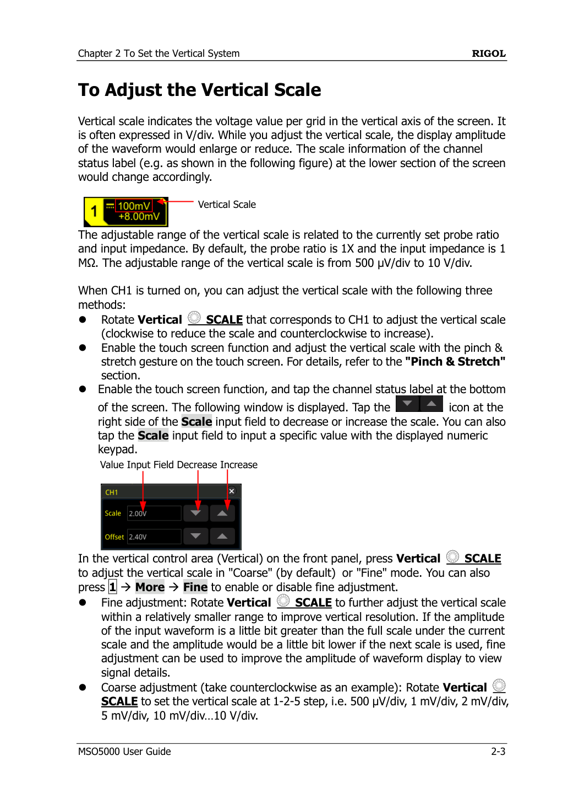
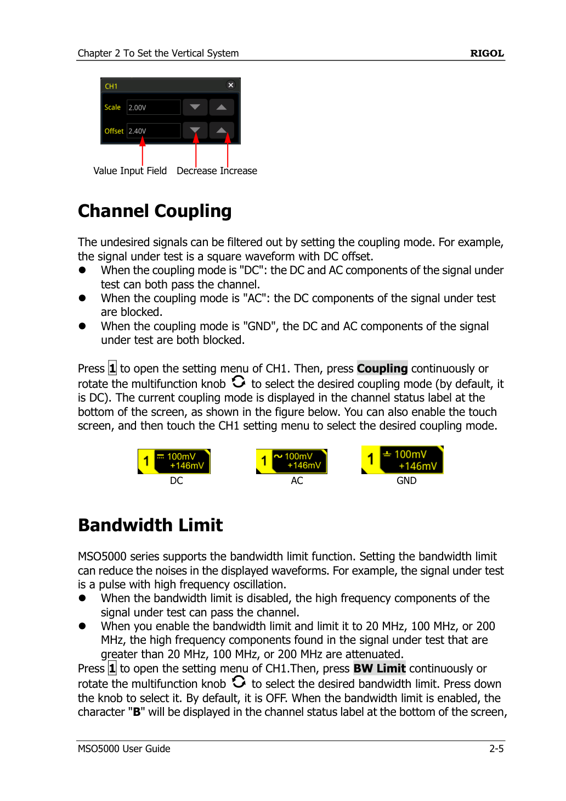
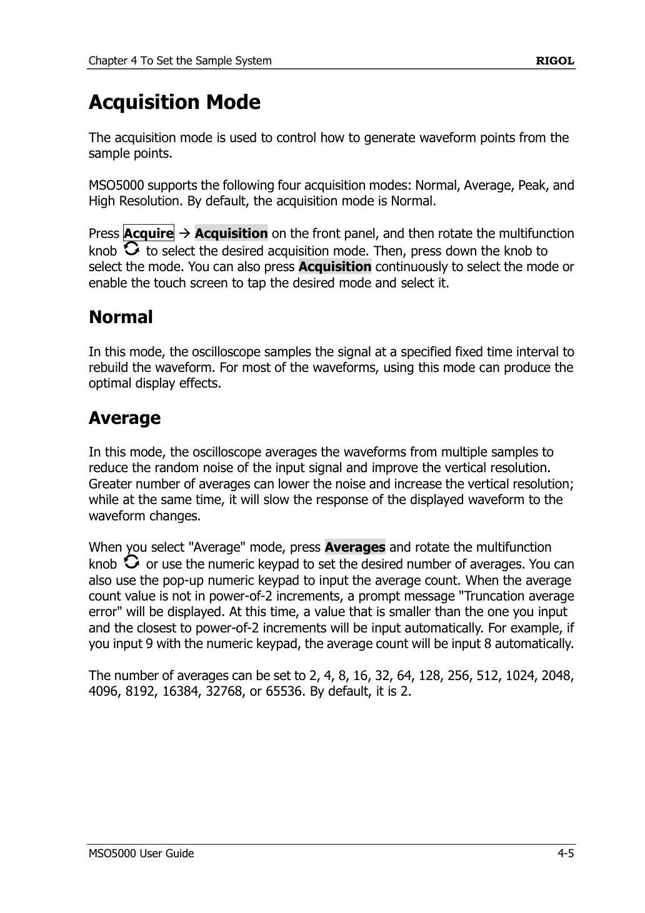
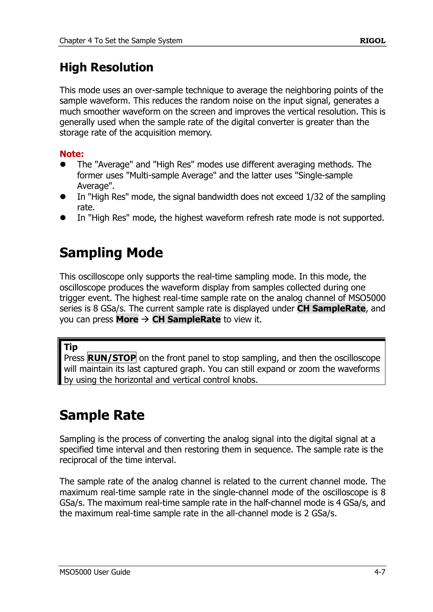
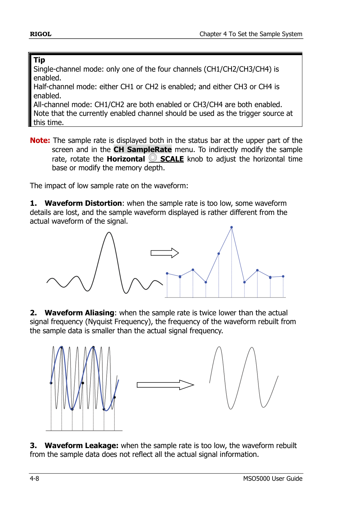
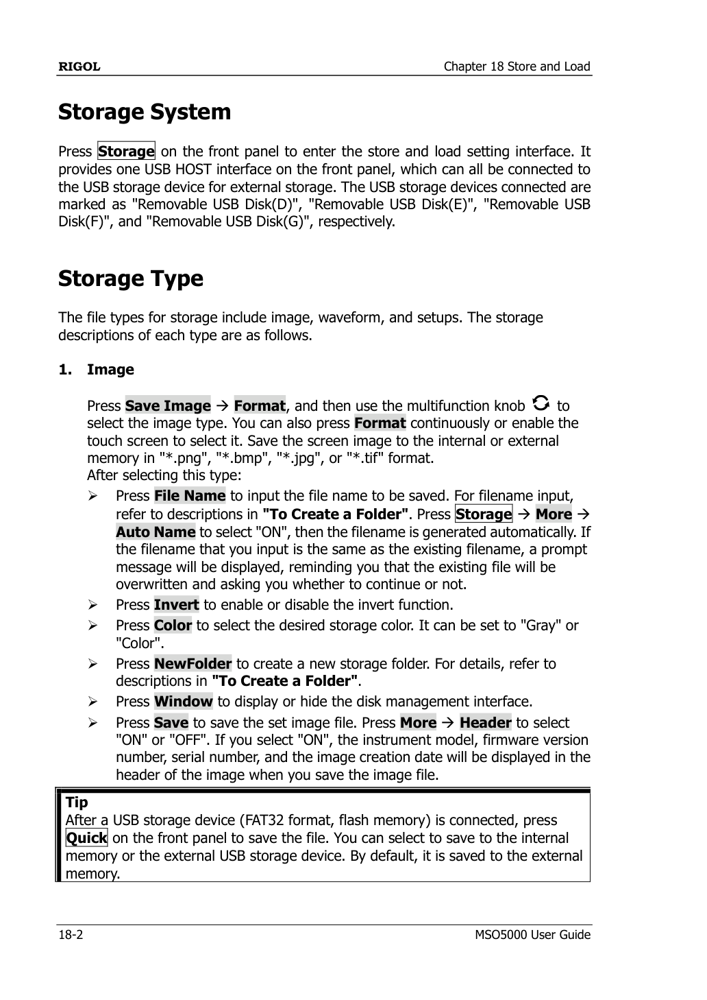
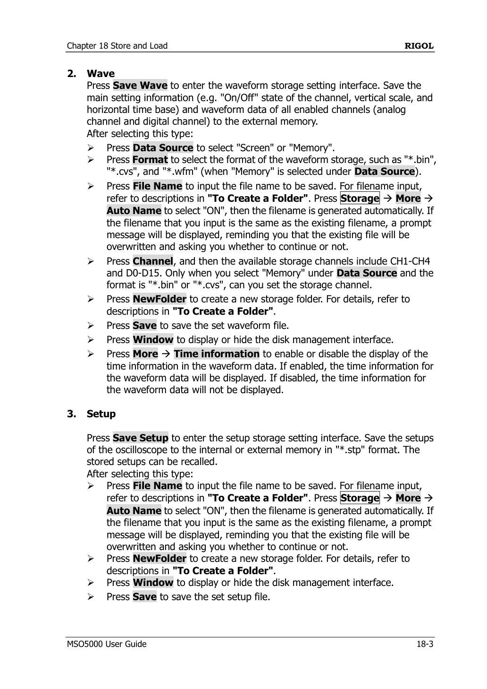

# Rigol MSO5074 CSV Export Analysis

Analysis of oscilloscope exports from a Rigol MSO5074.

- `proben0.csv` — **Save Screen** export
- `proben1.csv` — **Save Memory** export
  (both above are the **same CH1 acquisition** saved two ways)
- `RigolDS0.bin` — **binary waveform** export (a **separate, later**
  acquisition; see §8)

Generated by [analyze_rigol.py](analyze_rigol.py) plus follow-up checks on
time/voltage quantization.

---

**Contents**

[TOC]

---

## 1. Side-by-side summary

The two CSV files below are the **same acquisition**; the binary file is a
*separate* capture and is analysed on its own in §8 (shown here only for format
comparison).

| Property | proben0.csv (Save Screen) | proben1.csv (Save Memory) | RigolDS0.bin (Binary) |
|---|---|---|---|
| Header | `Time(s),CH1(V)` | `CH1(V),t0 = -25s, tInc = 2e-06s,` | `RG01` magic + binary header |
| Layout | explicit time + voltage per row | voltage only; time = `t0 + i·tInc` | header + raw float32 buffer |
| File size | 23.45 MB | 381.47 MB | **3.81 MB** |
| Samples | 1,000,000 | 25,000,000 | 1,000,000 |
| Start time | −15 s | −25 s | 0 s |
| End time | +15 s | +25 s | 50 s |
| Duration | 30 s | 50 s | 50 s |
| Sample interval | ~30 µs (true) | 2 µs (exact) | 50 µs (exact) |
| **Sample rate** | **~33,333 Sa/s (true)** | **500,000 Sa/s** | **20,000 Sa/s** |
| Channels | CH1 only | CH1 only | CH1 only |

> The three sample rates differ because of **acquisition settings (memory depth
> ÷ timebase), not the file format**. The binary file simply used a lower memory
> depth (1 Mpts over 50 s = 20 kSa/s).

---

## 2. Sample rate — the important correction

**Save Memory = 500,000 Sa/s**, stated exactly in the header (`tInc = 2e-06 s`).

**Save Screen is NOT 10,000 Sa/s.** Its true rate is **~33,333 Sa/s**
(1,000,000 points spread over 30 s → 30 µs spacing).

The "10 kSa/s / 100 µs" figure that a naive timestamp-difference produces is an
**artifact of timestamp rounding** (see below), not the real acquisition rate.

So Save Memory samples roughly **15× faster** than Save Screen (500k vs 33.3k),
and stores **25× more points**.

---

## 3. What Excel reveals about the Save Screen file

### 3.1 Time is rounded to 5 significant figures
- The `Time(s)` column is stored with only ~5 significant digits
  (`-1.5000E+01`, `-1.4999E+01`, …), i.e. ~10 µs resolution near ±15 s.
- True spacing is ~30 µs, so **3–4 consecutive samples share the same printed
  timestamp** (e.g. `-15.00000` repeated ~17 rows in Excel).
- Of 1,000,000 rows, only **256,669 timestamps are distinct**
  (avg ≈ 3.9 rows per timestamp).
- Because the smallest representable step is ~10 µs, the median difference
  between *distinct* timestamps comes out near 100 µs → the misleading
  "10 kSa/s". This is a rounding effect, not the sampling interval.
- **This rounding is fully recoverable and loses no data** (see §6.7): the
  samples are uniformly clocked, so the true axis is regenerated by re-indexing
  as `t[i] = t0 + i·30 µs`. The rounded column can simply be discarded.

### 3.2 Voltage is quantized to the ADC step (8-bit LSB)
- The Save Screen file contains only **82 distinct voltage levels**.
- Every value is an integer multiple of **8.7788 mV** — the oscilloscope's
  8-bit ADC least-significant bit on this vertical scale.
  - `0.0087788` = 1 LSB
  - `0.0175576` = 2 LSB
  - `0.0351152` = 4 LSB
  - `0.0614516` = 7 LSB
- This coarse vertical resolution also clips the signal peaks compared to the
  Save Memory data.

---

## 4. Signal statistics (CH1)

Both exports describe the same signal — DC offset and RMS agree closely.

| Metric | Save Screen | Save Memory |
|---|---|---|
| Min | −87.79 mV | −272.1 mV |
| Max | 632.1 mV | 640.9 mV |
| Peak-to-peak | 719.9 mV | 913 mV |
| Mean (DC offset) | 141.6 mV | 141.7 mV |
| RMS | 219.3 mV | 219.5 mV |
| Std deviation | 167.4 mV | 167.6 mV |
| Dominant freq (FFT) | 300.1 Hz | 300.1 Hz |

> Note: once the Save Screen sample interval is computed correctly (points ÷
> duration = 30 µs instead of the rounded 100 µs), its FFT also reports
> **300.1 Hz**, matching the Save Memory file.

---

## 5. Key takeaways

- **Save Memory is the high-fidelity export.** ~15× the sample rate, 25× the
  points, and a wider captured peak-to-peak — it preserves the raw deep-memory
  waveform.
- **Save Screen is reduced but not corrupted.** It rounds timestamps (5 sig
  figs) and snaps voltage to the 8.7788 mV ADC grid. Crucially, the timestamp
  rounding is **fully recoverable** by re-indexing (`t[i] = t0 + i·Δt`), and the
  samples are **genuine and contiguous** (not peak-detect) — so after
  reconstruction the Screen file is spectrally faithful for the dominant
  signatures (see §6.7). Its real limits are possible aliasing (~1.8 % of energy
  above its 16.7 kHz Nyquist) and the shared 8-bit vertical resolution.
- **Frequency content.** With the corrected time base, both files agree on a
  dominant component of ~300 Hz and the same harmonic series
  (50/300/600/900/1500 Hz). (Using the rounded 100 µs timestamp step would
  wrongly report ~90 Hz for the screen file — another reason to derive the rate
  from points ÷ duration.)
- When reporting the Save Screen sampling rate, use **points ÷ duration
  (~33.3 kSa/s)**, not the timestamp-difference value. The script now does this
  automatically.
- **For quantitative research, prefer Save Memory** for guaranteed alias-free
  records and the faintest (bearing) signatures; the reconstructed Save Screen
  file is adequate for RPM, line frequency, harmonics, looseness, transients and
  broken-rotor-bar analysis.

---

## 6. Suitability for scientific fault-detection research

*Goal of the study:* analyze motor/drive electrical signals to detect
**transient processes, running speed (RPM), electrical faults, phase reversal,
loose foundation/mechanical looseness, and bearing defects.** This is a
**Motor Current Signature Analysis (MCSA)** problem (supply frequency ≈ 50 Hz).

A measurement is fit for purpose only if it satisfies **three independent**
requirements. They must be assessed separately — a high sample rate does not
compensate for poor amplitude resolution.

| Requirement | Set by | Governs |
|---|---|---|
| **Bandwidth** (Nyquist) | sample rate `fs` | highest frequency that can be represented (`< fs/2`) |
| **Frequency resolution** `Δf` | record length `T` (`Δf = 1/T`) | ability to separate closely-spaced sidebands |
| **Dynamic range** | ADC bit depth | ability to see faint fault sidebands below the fundamental |

### 6.1 Frequency content that must be captured (50 Hz machine)

| Phenomenon | Where it appears in the current spectrum | Band |
|---|---|---|
| Phase reversal | phase sequence / fundamental | 50 Hz |
| Running speed / RPM | 1× rotational + harmonics | ~10–500 Hz |
| Mechanical looseness / loose foundation | sub-harmonics (0.5×) and harmonics of 1×, sidebands of 50 Hz | DC–~1 kHz |
| Broken rotor bars | sidebands `f_s(1 ± 2ks)`, only a **few Hz** from 50 Hz | 40–60 Hz, sub-Hz spacing |
| Air-gap eccentricity / rotor-slot harmonics | `f_s ± m·f_r` and principal slot harmonics | up to several kHz |
| Bearing defects (BPFO/BPFI/BSF/FTF) | sidebands `f_s ± m·f_bearing` and harmonics | ~100 Hz–2 kHz |
| Startup / transient processes | broadband, **time-localized** envelope | DC–few kHz |

**Conclusion on bandwidth:** essentially all electrical fault signatures of a
line-fed induction machine live **below ~5 kHz**, occasionally to ~10–20 kHz for
high-order slot harmonics.

### 6.2 Empirical capability of each file

| | Save Screen (`proben0`) | Save Memory (`proben1`) | Requirement |
|---|---|---|---|
| Sample rate | 33.3 kSa/s | 500 kSa/s | — |
| Nyquist (max usable freq) | 16.7 kHz | 250 kHz | ≥ ~20 kHz ✓ both |
| Record length | 30 s | 50 s | ≥ 10–20 s for rotor bars |
| Frequency resolution `Δf` | 0.033 Hz | 0.020 Hz | < ~0.5 Hz ✓ both |
| ADC depth (measured) | **8-bit, 82 levels, 8.78 mV LSB** | **8-bit, 97 levels, 8.78 mV LSB** | ≥ 10–12 bit desired |
| Faithful contiguous samples? | **No** — display-decimated, timestamps rounded | **Yes** | required for transients/spectra |

**Key measured fact:** Save Memory does **not** give more vertical resolution.
Both are 8-bit (the MSO5074 has an 8-bit ADC). The Memory export's advantage is
**bandwidth and an honest, contiguous time series**, not dynamic range.

### 6.3 Is the *sample rate* enough?

- **Save Memory — 500 kSa/s: YES, with large margin.** Nyquist 250 kHz vastly
  exceeds the < 20 kHz needed for MCSA. It is, if anything, *higher than
  necessary* for current analysis — that headroom could instead be spent on a
  longer record (finer `Δf`) or larger memory depth.
- **Save Screen — 33.3 kSa/s: adequate once the time axis is reconstructed.**
  Bandwidth (16.7 kHz Nyquist) covers MCSA. The export is *reduced* (rounded
  timestamps, screen-resolution decimation) but **not corrupted**: the rounding
  is fully recoverable by re-indexing and the samples are genuine/contiguous
  (verified in §6.7). The remaining concerns are **possible aliasing** of the
  ~1.8 % of energy above 16.7 kHz (if no anti-alias filter preceded the
  decimation) and the shared 8-bit resolution — so for the faintest signatures
  and guaranteed alias-free spectra, **Save Memory is still preferred**.

### 6.4 Is the *dynamic range* (8-bit) enough? — the real limitation

- Fault sidebands are weak: broken-rotor-bar sidebands are typically **−40 to
  −60 dBc**, bearing-defect sidebands **−50 to −70 dBc**, relative to the 50 Hz
  fundamental.
- An ideal 8-bit ADC gives SQNR ≈ **49.9 dB**. Here only ~97/256 codes are used
  (≈ **6.7 effective bits**, ≈ 42 dB) — the vertical scale was **not optimized**,
  wasting > 1 bit.
- **Saving grace — FFT processing gain.** With a long record the per-bin noise
  floor drops by `10·log₁₀(N/2)`:
  - Memory (`N = 25·10⁶`): ≈ **71 dB** of gain → spectral floor ≈ −113 dBc;
  - Screen (`N = 10⁶`): ≈ **57 dB** → spectral floor ≈ −99 dBc.
  - So small sidebands **can** be dug out of an 8-bit record **provided** the
    quantization noise is randomized by real signal noise (natural dither) and
    the signal is stationary over the record. This is why long records partly
    rescue the modest bit depth.
- **Net:** dynamic range is **marginal-but-workable** for rotor-bar and
  eccentricity signatures on the Memory file; it is **weak for bearing
  detection**, where current signatures are faintest.

### 6.5 Verdict per phenomenon (using the Save Memory file)

| Phenomenon | Verdict | Limiting factor |
|---|---|---|
| Phase reversal | ✅ Trivially sufficient | none |
| RPM / running speed | ✅ Sufficient | none |
| Startup / transient processes | ✅ Sufficient (true 2 µs samples) | use Memory, never Screen |
| Mechanical looseness / loose foundation | ✅ Adequate | amplitude marginal; long record helps |
| Broken rotor bars | ✅ Adequate | needs optimized vertical scale + long `T` |
| Eccentricity / slot harmonics | ✅ Sufficient | none |
| Bearing defects | ⚠️ Marginal via current alone | 8-bit dynamic range; prefer vibration/acoustic channels |

### 6.6 Recommendations for the acquisition (act before the next campaign)

1. **Use Save Memory only** for analysis. Prefer the native binary
   (`.bin`/`.wfm`) over CSV — it is exact, far smaller than the 381 MB CSV, and
   carries full metadata.
2. **Optimize the vertical scale** so the signal fills ≥ 80 % of the screen
   (full ADC range). Today only ~97/256 codes are used; rescaling recovers
   > 1 effective bit at zero cost.
3. **Enable High-Resolution acquisition mode** (boxcar averaging) to gain
   effective bits and provide built-in anti-alias filtering.
4. **Right-size the sample rate.** 500 kSa/s is overkill for current analysis;
   ~20–50 kSa/s already covers slot harmonics. Spending the saved memory on a
   **longer record** improves `Δf`, which matters most for rotor-bar sidebands
   at low slip.
5. **Keep records ≥ 10–20 s** (both files already do) for sub-Hz resolution to
   resolve `f_s(1 ± 2s)` sidebands.
6. **Detect bearings and looseness primarily from the dedicated vibration and
   acoustic channels** (`вибрации/`, `звук/`); current-based bearing detection
   is inherently weak and is best used only as corroboration.
7. **Mind aliasing:** never analyze the Screen/peak-detect export spectrally;
   ensure anti-alias filtering (hi-res/decimation mode) on the Memory export.

### 6.7 Re-examined: can we reconstruct the Save Screen time axis, and is the data then enough?

**Yes to reconstruction — exactly.** The scope samples on a uniform clock, so the
true time of sample *i* is

> `t[i] = t0 + i · Δt`, with `Δt = 30 s / (N − 1) = 30.00 µs` (N = 1,000,000).

The rounded `Time(s)` column carries **no extra information** — we simply discard
it and regenerate the axis from the sample index. (This is precisely what the
Save Memory format does: it stores only `t0` + `tInc`, no per-sample timestamps.)
So the 5-significant-figure rounding is a **non-issue for timing** — it is fully
recoverable. The earlier "timestamps are rounded" concern is therefore cosmetic,
not a loss of data.

**Is the Save Screen record then sufficient? Empirically tested — mostly yes for
this signal, with two real caveats.** Measurements on `proben0` with the
reconstructed axis:

| Test | Result | Interpretation |
|---|---|---|
| Local-extrema fraction | **0.079** | Smooth, genuine contiguous samples — **not** peak-detect min/max zig-zag (which would be > 0.6) |
| Top spectral lines 0–2 kHz | **50, 150, 300, 600, 900, 1500 Hz** | Matches Save Memory (50, 300, 600, 900, 1500 Hz) — same harmonic structure |
| Frequency resolution `Δf` | 1/30 s = **0.033 Hz** | Fine enough for rotor-bar sidebands |
| Signal energy within 16.7 kHz Nyquist | **98.2 %** | Bulk of the signal is inside the Save Screen band |

**Caveats — what time-axis reconstruction does NOT fix:**

- **Aliasing.** **1.78 %** of the signal energy (measured on the Memory file)
  lies *above* the Save Screen Nyquist of 16.7 kHz. If no anti-alias filter
  preceded the on-screen decimation, that content folds back into the analysis
  band as a raised noise floor. Small here, but it limits the faintest
  (bearing) sidebands.
- **8-bit amplitude quantization** is unchanged — still the binding limit for
  bearing-fault detection.
- **The rate was incidental.** 33.3 kSa/s arose from 1 Mpts ÷ 30 s; a different
  timebase or memory depth would yield a different (possibly lower) screen rate.

**Verdict:** with the time axis reconstructed by re-indexing, the Save Screen
file **is adequate for RPM, line frequency, harmonics, mechanical looseness,
transients and broken-rotor-bar analysis** of this signal. For faint bearing
sidebands and a guaranteed alias-free record, **still prefer Save Memory**.

### 6.8 Bottom line

- **Sample rate is *not* the bottleneck.** Save Memory's 500 kSa/s is more than
  enough for every electrical motor-fault signature; Save Screen's 33 kSa/s
  *rate* also suffices, and — with the time axis reconstructed by re-indexing —
  its samples are genuine and spectrally faithful for the dominant signatures.
  Its residual weaknesses are **possible aliasing** (~1.8 % out-of-band energy)
  and the shared 8-bit resolution, so for the faintest faults Save Memory
  remains preferable.
- **The true limitation common to both is the 8-bit vertical resolution.** It is
  adequate (helped by long-record processing gain) for rotor-bar, eccentricity,
  looseness and transient/RPM work, but **marginal for bearing-fault detection**
  from current — for which the vibration/acoustic channels should lead.

---

## 7. Lab procedure: improving vertical resolution & exporting properly

> **Send this section to the team.** It is written for the **Rigol MSO5074**
> (8-bit ADC, 8 GSa/s, up to 100 Mpts). The goal is to convert the modest 8-bit
> front-end into an effective **10–12 bits** and to export data that is exact
> and analysis-ready. Firmware menu names follow UltraVision II; wording may
> differ slightly between firmware versions.

### 7.1 Background — why we only had ~6.7 effective bits

The scope digitizes with an **8-bit ADC (256 codes)**. Resolution is fixed in
*codes*, not volts, so the only way to gain real bits is to (a) make the signal
fill more of those codes, and (b) average away quantization noise. In our files
only ~82–97 of 256 codes were used → ~6.7 effective bits. The steps below
recover the wasted bits and add more.

### 7.2 Part A — Fill the ADC range (free ~1–2 bits)

This is the single most important fix and costs nothing.



*Vertical scale — press the `CH` key and turn the large `SCALE` knob (User Guide §2, p.2-3).*

1. **Connect only the channel(s) you need** and set the correct probe
   attenuation: `CH → Probe` (e.g. 1× or 10×) so the displayed volts are true.
2. **Remove DC offset from the screen:** set vertical **Offset/Position** so the
   signal sits centred, then reduce **Volts/div** (`SCALE` knob) until the
   waveform fills **≈ 80–90 % of the screen height** *without ever clipping*.
   - Clipping (flat top/bottom) destroys data — back off one step if you see it.
   - Include transients/startup surges in the “must not clip” budget; capture a
     trial run first to learn the true peak.
3. **Use DC coupling** (`CH → Coupling → DC`) so the full waveform is preserved.
   Only use AC coupling if a large DC bias forces you to a coarse scale — then
   AC coupling lets you zoom the AC part for more codes.

   

4. **Verify:** the more screen the trace fills, the more of the 256 codes are
   used. Filling 80 % vs our 30–38 % recovers more than a full effective bit.

### 7.2a Choosing the vertical range under variable load / reversal

The captures `1v0.bin` / `500.bin` were taken at **20 % of rated motor power**,
where the current is small. The dilemma: if you scale to fill the screen at
20 %, the signal will **clip** during high-current events — startup inrush
(typically **5–8× rated current**), overload, or **direction reversal**.
Clipping flattens the peaks and **destroys data** (and injects false harmonics
into the spectrum). Established practice:

1. **Scale for the worst case, not the present operating point.** The metrology
   rule: set the vertical range (V/div) to the **maximum expected amplitude**
   (inrush, reversal, overload), not the momentary level. Do a trial capture of
   the harshest event first to learn the true peak. Better to "waste" a little
   resolution at 20 % than to clip during startup.
2. **Split the study by operating point (preferred).** Motor-diagnostics studies
   almost always use a **series of separate records** — one per steady state
   (10 %, 20 %, 50 %, 100 % load), each with a scale optimized for *that* point,
   so every record uses the full ADC range. Capture **transients (startup,
   reversal) as their own dedicated records** with a wider range. This is the
   structure already seen in the `ток осцилоскоп/` folder (`1%`, `5%` … `100%`).
3. **Recover the bits with settings, not range.** Use **High Resolution mode**
   (§7.3): it yields ~10–12 effective bits by oversampling/averaging, so even a
   small 20 %-load signal is well resolved on a wide, clip-safe range. This is
   the best single answer to the small-signal-vs-clipping dilemma. If the current
   clamp has range settings, pick the one that matches the regime.
4. **Offset shifts, it does not scale.** Centring with vertical offset is fine,
   but the V/div range must still contain the peaks — offset cannot rescue a
   range too coarse or too fine.
5. **Move the zero line to the bottom for a unipolar signal.** The 20 %-load
   current here is almost entirely positive (min ≈ −22…−44 mV, max ≈ +2.7 V). On
   a bipolar, zero-centred scale half the screen (and ~1 effective bit) is
   wasted. Drop the **0 V reference toward the bottom of the screen** and then
   **reduce V/div** so the worst-case peak reaches ~90 % at the top → the full
   ADC range is used upward. Two cautions: (a) offset only moves the window —
   you must *also* lower V/div to actually gain bits; (b) leave ~1 division below
   zero so the small negative excursions (min ≈ −44 mV) are not clipped.

**Recommendation for this work:** for MCSA across loads and reversal, use either
(a) a **single fixed range sized for the inrush/reversal peak + High Res** so all
records are directly comparable and nothing clips, or (b) a **per-regime range**
for best resolution at each point — in which case **record V/div and offset for
every file** so the records remain comparable. Avoid clipping at all costs: a
clipped record corrupts the spectrum with spurious harmonics that mimic faults.

### 7.2b DC-motor specifics (this is a *brushed* DC servo machine)

The machine under test is a **brushed permanent-magnet DC servo motor**,
type **3PI12.12**, with the following nameplate data:

| Parameter | Value |
|---|---|
| Type | Brushed PM DC servo (commutator + graphite brushes) |
| Rated power | 625 W (0.625 kW) |
| Rated voltage | 110 V DC |
| Rated current | 12.5 A |
| Rated torque | 5.4 N·m |
| Rated speed | 2000 RPM (at 100 % load); ~200 RPM at the ~20 % operating point of these captures |
| Poles | 4 (stator PM excitation) |
| Commutator segments | ~24–36 |
| Drive | External **thyristor (SCR) converter, 14XXX series** — 4-quadrant, smooth regulation of armature **voltage and current**; tacho/encoder feedback — **no built-in driver** |

> The drive is a **thyristor-based converter** (14XXX series), giving smooth
> regulation of both armature voltage and current. This supports flexible
> testing of speed/torque strategies, transient regimes and dynamic load
> variation. It is **not** a PWM (MOSFET/IGBT) drive — which is decisive for
> interpreting the spectrum below.

Because it is **brushed DC** (not an AC induction machine, and **not BLDC**),
the AC-induction "MCSA" framing of §6 does **not** map one-to-one. Account for:

- **The current is unipolar DC + ripple**, not a 50 Hz sinusoid. The armature
  current carries a DC level (proportional to load/torque) plus ripple. This is
  exactly why the offset-to-bottom strategy above is so useful here.
- **Keep DC coupling — never AC couple.** The DC level *is* the signal (it
  encodes load/torque and reversal). AC coupling would discard it. The earlier
  "AC coupling to gain codes" tip applies only to AC machines, not here.
- **Two ripple sources to expect in the spectrum:**
  - **Thyristor-converter ripple (mains-locked).** The armature is fed from a
    **3-phase 6-pulse thyristor converter**, which produces ripple at
    **6 × 50 = 300 Hz** plus harmonics (600, 900 Hz …) on the 50 Hz mains. This
    is **locked to the mains and independent of motor speed**. At light load /
    large firing angle the ripple is *deeper* (the conduction notches widen), so
    it is most prominent exactly in these low-speed captures.
  - **Commutation (brush) ripple** at `f_comm = N_segments × f_rot`, where
    `f_rot = RPM / 60`. This is **speed-dependent**: `24…36 × 33.3 Hz ≈
    800…1200 Hz` at **2000 RPM (100 %)**, but only `≈ 80…120 Hz` at the
    **~200 RPM (≈20 %)** operating point of these files. This band carries
    **commutator/brush-wear** information and is a primary brushed-DC
    diagnostic — make sure the bandwidth/sample rate covers it (16–20 kSa/s
    easily does).
  - **Rotational and its harmonics** at `f_rot = RPM / 60` (3.3 Hz at ~200 RPM,
    33.3 Hz at 2000 RPM); imbalance/eccentricity/looseness modulate these and
    the commutation band.
- **Interpreting the measured ~300 Hz.** This **is** the `6 × 50 Hz` ripple of
  the **3-phase 6-pulse thyristor converter** — a **supply/drive signature, not
  a mechanical fault**. The decisive clue: the dominant line is **~300 Hz in
  *every* file** even though the captures span different loads/speeds. If it
  were commutation ripple it would *track speed* (80–120 Hz at 200 RPM,
  800–1200 Hz at 2000 RPM); the fact that it stays pinned at 300 Hz proves it is
  **mains-locked converter ripple**. ➜ Don't mistake it for a defect. To isolate
  the mechanical/commutation content, **log the actual RPM** (tacho/encoder)
  with each record and look in the speed-tracking bands above; optionally notch
  out 300/600/900 Hz before fault analysis.
- **Reversal on this rig stays unipolar (current never goes negative).** The
  controller used here **does not drive the armature current below 0 even in
  reverse** — direction is changed without a negative current excursion. So the
  “0 at the bottom” unipolar scaling is safe for **all** regimes, including
  reverse: nothing clips at the bottom. (On a drive that *does* produce negative
  / regenerative current, you would instead need a bipolar, zero-centred scale
  — but that is **not** the case here, confirmed by measurement.)
- **Inrush / stall current.** With a 4Q servo drive the start/stall current is
  limited by the drive's torque (current) limit, but it can still reach several
  times the 12.5 A rating for short bursts. Scale the shunt/probe so this peak
  does **not** clip, then trade range back to the working level once you confirm
  the running current envelope.
- **Faults of interest** on a brushed DC machine: **brush/commutator wear and
  arcing**, **bearings, eccentricity, mechanical looseness**, and (for a PM
  servo) **magnet demagnetization** after over-current. These modulate the DC
  level, the commutation band and the rotational harmonics.
- **Field vs armature.** This is PM-excited, so there is no separate field
  winding to monitor — focus on the **armature current**. (If a wound-field
  variant is ever tested, record field and armature on separate channels.)

### 7.3 Part B — High-Resolution acquisition mode (adds ~1–4 bits)

`Acquire → Mode` offers four modes. Choose deliberately:





| Mode | What it does | Use for |
|---|---|---|
| **Normal** | one ADC sample per point | general |
| **Average** | averages N **repeated** acquisitions | **stationary, repetitive** signals only |
| **High Res** | boxcar-averages adjacent samples of a **single** shot → more bits **and** a built-in low-pass (anti-alias) | **our case** — single long records, transients |
| **Peak Detect** | keeps min/max — **never for analysis** | glitch hunting only |

**Recommended:** `Acquire → Mode → High Res`.
- High-Res trades excess sample rate for vertical bits. Since 500 kSa/s is far
  more than MCSA needs, this is “free” resolution: it can yield **~10–12 bits**
  while still leaving ≥ 20 kHz of bandwidth.
- It also **band-limits before decimation**, which removes the aliasing risk.
- Use **Average mode** *only* if the signal is perfectly periodic and the machine
  state is steady — it does **not** work for transients (startup, load changes).

### 7.4 Part C — Set rate, memory depth and record length



1. `Acquire → Mem Depth`: choose a **fixed** depth (e.g. 1 Mpts–25 Mpts) rather
   than “Auto”, so the sample rate is predictable. Displayed `fs = MemDepth /
   timebase span`.
2. **Right-size the rate.** For 50 Hz MCSA, **20–50 kSa/s** already covers slot
   harmonics. Prefer spending memory on a **longer record** than on excess rate.
3. **Record length ≥ 10–20 s** for sub-Hz frequency resolution (`Δf = 1/T`),
   needed to separate rotor-bar sidebands `f_s(1 ± 2s)` at low slip.
4. Set the **horizontal timebase** so total span = desired record length, then
   confirm the resulting `fs` on screen.

### 7.5 Part D — Export the right way (exact, compact, complete)

Avoid CSV for primary archives — our Save-Memory CSV was **381 MB** and still
only 8-bit text. Use the native binary instead.





> Note from the manual (p.18-3): the per-channel **storage channel** can only be
> set when **Data Source = Memory** *and* the format is `.bin` or `.csv`. The
> `.wfm` format always stores the full deep-memory record.

1. Press **`Save/Recall` (or `Storage`) → Waveform**.
2. **Source:** select the specific analog channel(s) — not “Screen”.
3. **Format — preferred order:**
   - **`.wfm` (RIGOL binary)** — exact, smallest, keeps all settings/metadata.
     Best for archiving and re-loading on the scope.
   - **`.bin`** — compact binary, easy to parse in Python/MATLAB
     (`int8/int16` codes + header scale/offset). Good interchange format.
   - **`.csv`** — only when a tool truly needs text; expect huge files and 5-sig-fig
     time rounding. If used, prefer **Save Memory**, never **Save Screen**.
4. **Data source = Memory (deep memory), not Screen**, so you get every sample,
   not the decimated display buffer.
5. Save to a fast USB-3 stick or pull data over LAN with SCPI
   (`:WAV:SOURce`, `:WAV:MODE RAW`, `:WAV:FORMat BYTE`, `:WAV:DATA?`) for
   automated, repeatable captures.
6. **Record the scaling** (`YINCrement`, `YORigin`, `YREFerence`, `XINCrement`,
   `XORigin`) — these convert raw ADC codes back to volts/seconds. The `.wfm`
   /`.bin` headers contain them; CSV bakes them in but loses precision.

### 7.6 Part E — Hardware/setup hygiene (protect the bits you have)

- **Use the lowest usable attenuation** (1× over 10× when voltages permit): a 10×
  probe also multiplies noise referred to the input.
- **Short, shielded leads; solid ground**; keep the signal lead away from the
  drive/VFD power cabling to avoid PWM pickup.
- **Bandwidth-limit on purpose:** if you only care to ~20 kHz, enabling the
  channel **20 MHz BW limit** (`CH → BW Limit`) and using High-Res removes
  out-of-band noise that would otherwise eat codes.
- **Let the scope warm up** and run **Self-Cal** (`Utility → Self-Cal`) for gain
  accuracy.
- **Stationarity:** for averaging/long FFTs the machine speed/load must be
  steady over the record; otherwise sidebands smear. Capture transients as
  *separate, dedicated* single-shot records in High-Res.

### 7.7 Quick checklist (tape to the scope)

```
[ ] Probe attenuation set correctly (CH → Probe)
[ ] DC coupling
[ ] Signal fills 80–90% of screen, NO clipping (incl. transients)
[ ] Acquire → Mode → High Res   (Average only if steady & periodic)
[ ] Mem Depth fixed; record length ≥ 10–20 s
[ ] Sample rate ~20–50 kSa/s for MCSA (don't waste memory on excess rate)
[ ] 20 MHz BW limit ON if only ≤20 kHz needed
[ ] Save → Waveform → Source = channel → Format .wfm or .bin (Memory, not Screen)
[ ] Note Y/X scale & offset (or rely on binary header)
[ ] Bearings/looseness: also grab vibration + acoustic channels
```

### 7.8 Expected improvement

| | Before (our files) | After this procedure |
|---|---|---|
| ADC codes used | ~82–97 / 256 | ~200+/256 (fills screen) |
| Effective bits | ≈ 6.7 | **≈ 10–12** (fill + High-Res) |
| Aliasing risk | present (Screen) | removed (High-Res band-limit) |
| File size (25 Mpts) | 381 MB CSV | ~25–50 MB binary (`.bin`/`.wfm`) |
| Time/scale fidelity | 5 sig figs (CSV) | exact (binary header) |

### 7.9 Licensing — is any of this locked? (No)

**Every setting in this guide is standard on the MSO5074 and unlocked by
default — no license file is required.** The optional licenses on the MSO5000
series cover features we do **not** use for motor-current analysis.

| Feature used in this guide | Status on MSO5074 |
|---|---|
| Acquisition modes (Normal / Average / **High Res** / Peak Detect) | ✅ Standard, free |
| Deep memory up to **100 Mpts** | ✅ Standard (only the 200 Mpts upgrade is optional) |
| Waveform export to `.wfm` / `.bin` / `.csv` (deep memory) | ✅ Standard |
| SCPI remote + LAN/LXI + built-in web control | ✅ Standard |
| Channel 20 MHz bandwidth limit, vertical scale/offset, DC/AC coupling | ✅ Standard |
| FFT / Enhanced FFT math, measurements, Self-Cal | ✅ Standard |

**Paid option licenses (NOT needed for this work):**
- Bandwidth upgrade above 70 MHz — irrelevant for 50 Hz signals.
- 200 Mpts memory upgrade — 100 Mpts standard is already more than enough.
- Built-in arbitrary waveform generator (AWG).
- Serial decode/trigger (CAN / LIN / RS232 / I²C / SPI / FlexRay).
- Power-analysis application package.

**Requires extra hardware, not a license:** the 16 digital (logic-analyzer)
channels need the RPL logic probe. We use the analog channels, so this does not
apply.

> Note: menu names/availability depend on **firmware version**, not on any
> license. If High Res or a deep memory depth seems missing, update to the
> latest MSO5000 firmware from Rigol — the upgrade is free.

---

## 8. Binary exports (`.bin`) — separate acquisitions

These files were exported in Rigol's **binary waveform** format. They are
**not** the same signal as the two CSV files — they are later, independent
captures (different amplitude, rate and date), included to validate the binary
path and to compare
formats.

### 8.1 What's inside

| Property | Value |
|---|---|
| Format | Binary waveform, `RG01` magic, 1 waveform / 1 buffer |
| Sample encoding | **float32 volts** (4 bytes/point, exact — not 8-bit text) |
| Instrument | **MSO5074**, serial `MS5A262701593` |
| Captured | **2026-06-12 14:18:04** (embedded in header) |
| Samples | 1,000,000 |
| Sample interval | 50 µs → **20 kSa/s** (Nyquist 10 kHz) |
| Duration | 50 s (0 → 50 s) |
| File size | **3.81 MB** |

### 8.2 Signal statistics (CH1)

| Metric | Value |
|---|---|
| Min | −141.8 mV |
| Max | 5.105 V |
| Peak-to-peak | 5.246 V |
| Mean (DC offset) | 444.9 mV |
| RMS | 1.004 V |
| Std deviation | 899.6 mV |
| Distinct levels | **75** |
| Quantization LSB | **70.9 mV** (~6.2 effective bits over p-p) |
| Dominant freq | 0.78 Hz (period 1.28 s) |

The larger LSB (70.9 mV vs 8.78 mV in the CSV captures) reflects the **coarser
vertical scale** used for this ~5 V signal — still the same underlying 8-bit
ADC, only ~75 of 256 codes used.

### 8.3 Format comparison — is binary just "compressed"?

No. For a given acquisition the **samples are identical**, but the binary format
is qualitatively better than CSV, not merely smaller:

| Aspect | Binary `.bin` | CSV |
|---|---|---|
| Size (1 Mpts) | **3.81 MB** | ~24 MB (Screen-style text) |
| Numeric precision | exact float32 | rounded text (time to ~5 sig figs) |
| Metadata | model, serial, **date/time**, units, xInc/xOrig | none / one header line |
| Load speed | fast (binary slurp) | slow (parse millions of rows) |

### 8.4 Notes on sample rate

- At **20 kSa/s** this binary capture is the **lowest-rate** of the three files
  (vs 33.3 kSa/s Screen and 500 kSa/s Memory) — but the rate is a function of
  the **memory-depth/timebase setting at capture**, not the binary format.
- **20 kSa/s is still adequate for 50 Hz MCSA**: Nyquist 10 kHz covers the
  fundamental, harmonics and the principal fault sidebands. For high-order slot
  harmonics, raise `Acquire → Mem Depth` (see §7.4) on the next capture.
- The 8-bit / ~6.2-effective-bit limitation discussed in §6.4 applies here too;
  the §7 procedure (fill the screen + High-Res) is the way to improve it.

### 8.5 Additional binary captures (`1v0.bin`, `500.bin`)

Two more binary files, captured ~2.5 minutes apart on the same channel/setup.
The signal is nearly identical (~300 Hz, ~2.7 V p-p, ~0.18 V DC); the meaningful
difference is **vertical resolution**.

| Property | `1v0.bin` | `500.bin` |
|---|---|---|
| File size | 1.91 MB | 1.91 MB |
| Instrument | MSO5074 (S/N MS5A262701593) | same |
| Captured | 2026-06-12 19:47:02 | 2026-06-12 19:49:32 |
| Samples | 500,000 | 500,000 |
| Sample interval | 60 µs | 60 µs |
| **Sample rate** | **16.67 kSa/s** (Nyquist 8.3 kHz) | **16.67 kSa/s** |
| Time window | 10 → 40 s (30 s) | 10 → 40 s (30 s) |
| Min / Max | −44.4 mV / 2.706 V | −22.2 mV / 2.748 V |
| Peak-to-peak | 2.75 V | 2.77 V |
| Mean (DC) | 175.1 mV | 180.2 mV |
| RMS | 362 mV | 369.4 mV |
| Dominant freq | 300 Hz | 300.2 Hz |
| **Distinct levels** | **63** | **126** |
| **Quantization LSB** | **44.4 mV (~6.0 bits)** | **22.2 mV (~7.0 bits)** |

**Key point — `500.bin` is the higher-quality capture.** It resolves **twice**
the number of amplitude levels (126 vs 63) at **half** the LSB (22.2 vs
44.4 mV), i.e. ~7.0 vs ~6.0 effective bits. This is exactly the gain expected
from a **finer vertical scale or High-Res mode** (§7.2–7.3): same signal, same
rate, but more of the 256 ADC codes are used. Prefer the `500.bin`-style setup
for analysis.

Both run at 16.67 kSa/s (500k points ÷ 30 s), which is adequate for the 300 Hz
signal and its low-order harmonics; raise memory depth for higher-frequency
content.

> **Накратко (BG):** `1v0.bin` и `500.bin` са два почти еднакви записа (~300 Hz,
> ~2.7 V) от 12 юни, направени с ~2.5 мин разлика, за прозорец от **30 секунди
> (10–40 s) с по 500 000 точки**, което дава **16.67 kSa/s**. Sample rate-ът е
> по-нисък само защото при дълъг 30-секунден прозорец и ниска памет (Mem Depth)
> точките се разпределят рядко (500 000 ÷ 30 s). Единственото за подобряване е
> вертикалната резолюция — `500.bin` вече е по-добрият (126 нива срещу 63), а
> още по-добре става **само чрез настройки**: запълни сигнала 80–90 % от екрана
> и/или включи `Acquire → High Res`; за по-висок sample rate вдигни
> `Acquire → Mem Depth`.

---

## 9. Multi-sensor study guidance (current + vibration + sound)

Three independent sensors are available, which is a major advantage: each fault
leaves a signature in more than one domain, so **cross-confirmation** turns a
"maybe" into a finding and rejects measurement artifacts.

### 9.1 What each sensor sees

| Sensor | File type | What it is | Strength | Limitation |
|---|---|---|---|---|
| **Current** (oscilloscope) | `.csv` / `.bin` | Armature-current waveform, kSa/s, 8-bit | Sees electrical + load/torque + converter (300 Hz) signatures directly | 8-bit vertical (see §6.4); single channel |
| **Vibration** (vibrometer) | `.XLS` | **Overall RMS spot values** — Velocity (mm/s), Acceleration (m/s²), Displacement (mm), time-stamped | ISO-10816-comparable trend numbers; direct mechanical evidence | **Not a waveform** — no spectrum, so it cannot localise a fault frequency on its own |
| **Sound** (phone) | `.wav` | Stereo, 44.1 kHz, 16-bit, ~31 s waveform | Full spectrum to 22 kHz, 16-bit; catches bearing/brush squeal, looseness rattle | Room acoustics, reflections, background noise; not calibrated (relative only) |

> The `.XLS` vibration files are **point readings** (one Velocity / Acceleration
> / Displacement value per timestamp), not time series. They are excellent for
> **trending vs load** but you **cannot FFT them**. To get a vibration
> *spectrum* you need the vibrometer's raw time-waveform/FFT export (if it has
> one) or an accelerometer logged on a spare scope/DAQ channel.

### 9.2 The golden rule — measure all three at the same operating point

The dataset is already organised by **load (%)**: current, `вибрации\NN.XLS`
and `звук\NN.wav` all exist for 5, 10, 20 … 100 %. Keep this discipline:

- **One run = one load level**, with **all three** sensors capturing the **same
  steady state**. Let the speed settle before recording.
- **Log the operating point** every time: load %, **actual RPM** (tacho), drive
  firing angle/armature voltage, and bearing/ambient temperature.
- Use a **common, sortable naming scheme** so files line up across folders,
  e.g. `2026-06-12_load020_run1_current.csv`, `…_vib.XLS`, `…_audio.wav`.
- **Time-align** the records (a shared start marker — e.g. a brief load step or
  a hand clap visible/audible in all three — makes later correlation trivial).

### 9.3 Which fault shows where (cross-confirmation map)

| Phenomenon | Current | Vibration | Sound | Confirm by |
|---|---|---|---|---|
| **Converter ripple (300 Hz)** | strong 300 Hz line, **speed-independent** | usually absent mechanically | faint 300 Hz hum if at all | present in current at **all** speeds → electrical, **not** a fault |
| **Commutation / brush wear** | ripple at `S × RPM/60` (~80–120 Hz @200 RPM), broadband arcing noise | rises with wear | **brush squeal/chatter**, broadband hiss | current band **tracks speed** + audible squeal |
| **Bearing defects** | weak sidebands around line/commutation | clear at BPFO/BPFI/BSF/FTF freqs | high-freq tonal whine/grinding | vibration spectrum is the primary; sound confirms |
| **Imbalance** | 1× RPM modulation (small) | **large 1× RPM** velocity peak | low rumble at 1× | vibration 1× dominant, drops if balanced |
| **Misalignment** | 1×/2× modulation | **2× RPM** prominent, axial component | — | 2× in vibration + axial reading |
| **Mechanical looseness** | erratic load current | raised noise floor, many RPM harmonics | rattling | vibration harmonics + audible rattle |
| **Eccentricity / bent shaft** | 1×/2× modulation | 1×/2× with phase shift | — | vibration phase across the machine |

Rule of thumb: **electrical-only** signatures appear in current but not in
vibration/sound; **mechanical** signatures appear in vibration (and often sound)
and only weakly modulate the current.

### 9.4 Vibration (vibrometer) best practice

- **Mounting matters most.** Rank by usable bandwidth: **stud-mounted ≫ glue/
  adhesive > magnet ≫ hand-held probe**. A hand-held probe is only valid below
  ~1 kHz — fine for imbalance/looseness, useless for bearings. Use the same
  mount and the same spot every time.
- **Measure in 3 directions** at each bearing: **horizontal, vertical, axial**.
  Misalignment shows axially; imbalance shows radially.
- **Use the right quantity:** **velocity (mm/s RMS)** for general severity
  (ISO 10816 / ISO 20816 trend), **acceleration (m/s²)** for high-frequency
  bearing/gear faults, **displacement** for low-speed/shaft issues.
- **Trend, don't spot-judge.** A single number means little; the **change vs
  the same load over time** is the diagnostic. Plot Velocity-RMS vs load % and
  watch the curve move between test campaigns.
- If the vibrometer can export a **time waveform or FFT**, use that for
  bearing-frequency analysis — the overall RMS in the `.XLS` files cannot
  localise a defect frequency.

### 9.5 Sound (phone) best practice

- **Treat it as qualitative/relative.** A phone mic is not calibrated, so use it
  for **spectral shape and change**, not absolute dB. Keep mic distance and
  angle fixed between runs (mark a spot on a tripod/stand).
- **Record format:** prefer **WAV/PCM (lossless)**, not compressed MP3/AAC —
  lossy codecs smear transients and add artifacts. 44.1 kHz / 16-bit is plenty
  (covers to 22 kHz). Disable any "noise suppression"/"voice enhancement"
  processing in the recorder app — it destroys machine-noise spectra.
- **Control the environment:** quiet room, no reflective clutter, motor not
  sitting on a resonant bench; capture a **background-noise reference** (motor
  off) to subtract/spot ambient lines.
- **Mind aliasing-free range:** 44.1 kHz → 22 kHz usable; good for brush squeal,
  bearing whine and looseness rattle, which is exactly the audible-fault band.
- **Analyse with a spectrogram** (time × frequency), not just an FFT — bearing
  and brush faults are often **intermittent**, and a spectrogram reveals bursts
  that a single averaged FFT hides.

### 9.6 Test matrix to run

For a defensible study, capture this grid **per machine condition** (healthy
baseline first, then each seeded/observed fault):

1. **Load sweep:** 5, 10, 20, 30, 40, 50, 60, 70, 80, 90, 100 % — all three
   sensors at each step, steady state. (You already have this layout.)
2. **Speed/RPM logged** at every step (don't assume linear 20 %→400 RPM; the
   thyristor drive's speed depends on firing angle and load — measure it).
3. **Transients (current + sound, scope in single-shot):** start-up, sudden
   load step, **reversal** (unipolar on this rig — current stays ≥ 0, so the
   normal 0-at-bottom scale is fine), and stop/coast-down.
4. **Repeat ×3** at each key point to separate real effects from run-to-run
   scatter; report mean ± spread.
5. **Baseline vs fault:** the whole value is in the **difference** — always have
   a healthy reference recorded under identical settings to compare against.

> **Накратко (BG):** Имаш три сензора — **ток** (waveform), **вибрации**
> (overall RMS стойности в `.XLS`, без спектър) и **звук** (`.wav`, 44.1 kHz,
> 16-bit). Снимай и трите **в една и съща работна точка** (едно натоварване,
> установен режим) и **записвай реалните обороти** всеки път. Кръстосано
> потвърждение: **300 Hz е електрическо** (във всеки файл, не зависи от
> оборотите) → не е дефект; **механичните дефекти** (дисбаланс, разцентровка,
> лагери, разхлабване) се виждат най-добре във **вибрациите** (мери в 3 посоки,
> velocity mm/s по ISO 10816) и се чуват в **звука**. За лагерни честоти ти
> трябва **waveform/FFT** от виброметъра — overall стойностите в `.XLS` не
> локализират дефект. Телефонът е **относителен** (некалибриран): пиши в WAV,
> изключи шумопотискането, мери на еднакво разстояние и прави **спектрограма**.
> Винаги дръж **здрав baseline** за сравнение.

---

## 10. Native `.wfm` deep-memory exports — and are they better than `.bin`?

Two new files were added: `normal.wfm` and `normal_scaleddown.wfm`. The script
now parses the Rigol MSO5000 `.wfm` format (`python analyze_rigol.py
normal.wfm normal_scaleddown.wfm`).

### 10.1 What is inside a `.wfm`

| Property | Value |
|---|---|
| Layout | 4200-byte proprietary header + raw **8-bit** ADC codes, **1 byte/sample** |
| Samples | **25 000 000** (full deep memory) |
| File size | 23.85 MB (vs ~380 MB for the same points as CSV) |
| Vertical LSB | **857.9 µV/code** (read from header) |
| Codes used | **84 distinct**, range 0–186 |
| Sample rate | **not stored in any documented field** — assumed 500 kSa/s (25 M ÷ 50 s); override with `WFM_FS` |

> ⚠️ The `.wfm` **horizontal scale and absolute vertical offset are not openly
> documented**, so the script decodes the **vertical LSB and the raw codes
> exactly** (resolution + clipping are trustworthy) but **assumes** the time
> base. Pass the real rate with `WFM_FS=<Sa/s>` if it differs.

### 10.2 The two files are the *same* capture

`normal.wfm` and `normal_scaleddown.wfm` are **practically identical**: out of
25 000 000 samples only **4 differ** (correlation 0.9999989), the vertical LSB
is the same (857.9 µV), and the code range is the same (0–186). The
`scaleddown` name does **not** correspond to a finer vertical scale — there is
no resolution difference between them. Treat them as duplicate exports of one
acquisition.

### 10.3 The code-0 block is an *intentional* zero-current baseline (not clipping)

20 % of each record (4 999 949 of 25 M samples, a contiguous ~10 s block at the
**start**) sits at code 0. This is **deliberate and correct**, not a fault:
this is a **unipolar DC-motor current**, so 0 was placed at the **bottom of the
screen** (the offset-to-bottom strategy of §7.2a/§7.2b) to use the full ADC
range for the positive-only current. The code-0 block is simply the
**zero-current period before the motor was energised** — there is no signal
there to lose.

The data confirms it is a baseline, not clipping:

- The code-0 samples form **one contiguous block at the very start** (~0–10 s),
  not scattered through the running record.
- Once the motor runs, the signal **keeps clear headroom above the bottom
  rail**: its **1st percentile is code 62 of 255** and there are **no code-0
  samples** during operation. Nothing is railed.
- So the deliberate “0 at the bottom” worked exactly as intended: full positive
  range used, no negative excursions lost (the motor runs unipolar — no
  reversal/regeneration in this capture).

**Reversal is also unipolar on this rig — no bipolar record needed.** The
controller **keeps the current ≥ 0 even in reverse** (verified: at 1 V/div with
**100 % nominal load *and* reverse** the trace still fits on screen and never
hits either rail). The small negative readings in the data (e.g. `1v.bin`
min ≈ −0.31 V) are **measurement noise/offset around zero**, not real reverse
current, and they are fully captured because the baseline sits just above the
bottom rail. So the “0 at the bottom” unipolar scaling is valid for **every**
regime here. (Only a drive that produced genuine negative/regenerative current
would need a bipolar, zero-centred scale — not this one.)

**Analysis note.** The long flat baseline injects a large DC step that
**dominates the FFT** (the script reports a spurious ~0.02 Hz “50 s period”
line) and hides the real 300 Hz. This is *not* a data problem — just **analyse
only the running window** (skip the first ~10 s) and the true spectrum returns.
The updated script now recognises this pattern and prints a *zero-current
baseline* note instead of a false clipping warning.

### 10.4 Are `.wfm` better than `.bin`?

It depends on what “better” means — they win on **completeness**, not on
resolution:

| Aspect | `.bin` (RigolDS0) | `.wfm` (normal) | Winner |
|---|---|---|---|
| Encoding | float32 volts, 4 B/sample | raw 8-bit codes, 1 B/sample | `.wfm` (4× denser) |
| Points kept | 1 M (screen-decimated) | **25 M (full deep memory)** | **`.wfm`** |
| Bytes per million pts | ~4 MB | **~1 MB** | **`.wfm`** |
| Vertical resolution | 8-bit (~75 levels) | 8-bit (~84 levels) | tie (both 8-bit) |
| Self-describing | yes — volts, time, model, serial, date | **no** — undocumented time base/offset | **`.bin`** |
| Ease of use | load & go (already volts) | needs this custom parser; rate assumed | **`.bin`** |
| This capture’s quality | clean | clean (intentional zero baseline, no clipping) | tie |

**Bottom line.**
- The `.wfm` **format** is the better *archival* choice when you want the
  **entire deep-memory record** in the **smallest** file: 25× more samples than
  the 1 M `.bin`, at ~¼ the bytes per sample.
- But `.wfm` is **not** higher vertical resolution — it is the **same 8-bit**
  data, and it is **not self-describing** (the time base and vertical offset are
  undocumented, so any tool must assume them).
- For *this* dataset both captures are clean: the `.wfm` code-0 block is the
  **intentional zero-current baseline** (§10.3), not clipping. The `.bin` is
  still easier to use because it is self-describing (volts + time + metadata).
- **Recommendation:** use `.wfm` for compact full-depth archiving, and **always
  record the time/div and sample rate** alongside it, since the file itself does
  not preserve them in a documented way. For an analysis that must be
  self-contained and unambiguous, prefer `.bin` (or Save Memory CSV).

> **Накратко (BG):** `normal.wfm` и `normal_scaleddown.wfm` са **един и същ
> запис** (различават се само 4 проби от 25 млн.). Форматът `.wfm` пази **цялата
> дълбока памет — 25 млн. точки в 24 MB** (8-бит кодове, 1 байт/проба), затова е
> **по-компактен** от `.bin`, но е **същата 8-битова резолюция** и **не е
> самоописателен** (времевата база и вертикалният офсет не са документирани →
> sample rate се **приема** 500 kSa/s, override с `WFM_FS`). Блокът на код 0
> (≈10 s в началото, 20%) е **нарочен** — това е **DC мотор** с еднополярен ток,
> затова сте сложили **0 на дъното** на екрана (§7.2a/§7.2b), за да използвате
> целия обхват за положителния ток; този блок е просто **нулевият ток преди
> стартиране**, **не е клипинг**. Доказателство: по време на работа сигналът
> държи **запас над дъното (1-ви персентил = код 62 от 255)** и няма нито една
> проба на код 0. Единственото: дългата базова линия **доминира FFT** (фалшива
> ~0.02 Hz линия), затова анализирай **само работния прозорец** (пропусни
> първите ~10 s). Внимание: при **реверс/рекуперация** отрицателният ток би се
> отрязал → за такива тестове прави отделен **биполярен** запис.

---

## 11. Vertical-scale experiment — `1v.bin` vs `2v.bin` (1 V/div vs 2 V/div)

Two new captures were taken on 2026-06-16 with the *only* deliberate change
being the **vertical scale**, plus photos of the scope settings (`1V.jpg`,
`2v.jpg`).

### 11.1 Settings read from the photos

| | `1V.jpg` → `1v.bin` | `2v.jpg` → `2v.bin` |
|---|---|---|
| CH1 scale | **1.00 V/div** | **2.00 V/div** |
| CH1 offset | −3.00 V | −6.00 V |
| Time base | 25 s window, **1 MSa/s, 20 Mpts** | 25 s window, **1 MSa/s, 20 Mpts** |
| Trigger | CH1 edge, 728 mV | CH1 edge, 728 mV |
| Source / format | Memory → `.bin` | Memory → `.bin` |
| Captured | 15:48:41 | 15:50:29 |

Both the scale **and** the offset were doubled together (1→2 V/div, −3→−6 V),
which keeps the trace in the same place on the screen.

### 11.2 What the data shows

| Metric | `1v.bin` | `2v.bin` | Relationship |
|---|---|---|---|
| Samples | 20 000 000 | 20 000 000 | same |
| Sample rate | 1 MSa/s | 1 MSa/s | same |
| Window | −15 … +5 s | −15 … +5 s | same |
| Min / Max | −0.311 V / 5.057 V | −0.622 V / 10.124 V | **exactly ×2** |
| Mean / RMS | 0.517 V / 1.117 V | 1.035 V / 2.237 V | **exactly ×2** |
| Quantization LSB | 44.36 mV | 88.81 mV | **exactly ×2** |
| **Distinct levels** | **122** | **122** | **identical** |
| Effective bits | ~6.9 | ~6.9 | identical |
| **Correlation** | — | — | **1.0000000** |
| Sample-by-sample ratio | — | — | **2.0000** |

### 11.3 Conclusion — the scale did NOT change the recorded data

The two files are the **same digitised acquisition**: correlation **1.000**, the
`2v` volts are **exactly 2× the `1v` volts at every one of the 20 M samples**,
and **both use the identical 122 ADC codes**. Doubling the V/div (with the probe
/ scale factor) only **re-labels the volts**; the underlying 8-bit samples are
byte-for-byte the same.

➜ **The vertical scale factor alone does NOT improve (or harm) resolution.**
Both captures resolve the same **122 levels / ~6.9 effective bits**. To actually
gain resolution you must make the signal **fill more of the screen** — i.e.
increase the analog **sensitivity** so the waveform spans more divisions (more
ADC codes), and/or use **High-Res mode** (§7.3). Here the signal fills only
~122 / 256 ≈ 48 % of the ADC range (~3.8 of 8 divisions), so there is headroom
to gain ~¾–1 bit by tightening the scale until the peaks nearly fill the screen
**without clipping**.

### 11.4 Are these captures good now? — Yes, with one tweak

Compared with the earlier files, these are a clear step up:

- ✅ **1 MSa/s** — 50–60× faster than the earlier 16–20 kSa/s. Easily covers the
  300 Hz line, the commutation band (800–1200 Hz at 2000 RPM) and well beyond.
- ✅ **20 M points** over a 20 s window — full deep memory, `.bin` from Memory
  (the correct export choice, §5).
- ✅ **No clipping** — the spikes have headroom below the top rail and the
  baseline sits just above the bottom (min −0.31 V), so the small negative
  excursions are captured too (bipolar-safe).
- ✅ Self-describing `.bin` (volts, time, model, serial, date embedded).
- ✅ **1 V/div is validated for the worst case.** At 1 V/div the trace still
  fits the screen at **100 % nominal load *and* in reverse** — the two heaviest
  regimes — without touching either rail. Since this controller keeps the
  current **unipolar (≥ 0) even in reverse**, the same fixed 1 V/div range is
  safe for **all** load levels: no clipping anywhere, and every file stays
  directly comparable.
- ⚠️ **Resolution could still improve ~¾–1 bit** *in principle* by tightening
  V/div, **but only if a tighter scale still survives the 100 %+reverse peak**.
  Since 1 V/div is already the validated worst-case range, the safer way to add
  bits without risking the peak is **High-Res mode** (§7.3) rather than a tighter
  scale. Keep 1 V/div as the fixed range and turn on High-Res.

**Which file to keep:** they are redundant (same data). Keep the one whose
**probe / scale factor matches the real calibration** of your shunt or current
probe — i.e. the one whose volts equal the true measured value. If the shunt/
probe gives the actual current at the `1×` setting, **`1v.bin` is correct** and
`2v.bin` is the same data scaled 2× too high; verify against a known reference
(e.g. a DMM reading of the DC current) and discard the mis-scaled one.

> **Накратко (BG):** `1v.bin` и `2v.bin` са **един и същ запис** — корелация
> **1.000**, `2v` е **точно 2× по-голям** от `1v` във всяка от 20-те млн. проби,
> и **двата ползват едни и същи 122 ADC кода**. Разликата е само **1 V/div срещу
> 2 V/div** (с удвоен офсет −3→−6 V) от снимките. Изводът: **смяната само на
> вертикалния мащаб/probe фактор НЕ променя резолюцията** — и двата дават
> **122 нива / ~6.9 бита**. За повече резолюция трябва сигналът да **запълни
> повече от екрана** (по-чувствителен V/div, докато пиковете почти опрат
> горе, без клипинг) и/или **High-Res режим**. Иначе записите са **много добри
> вече**: **1 MSa/s** (50–60× по-бързо от преди), 20 млн. точки, `.bin` от
> Memory, **без клипинг**, хваща и малкия отрицателен ток. Препоръка: запази
> този файл, чийто **probe фактор отговаря на реалната калибровка** на шунта/
> токовата клещя (сверй с DMM кой дава истинския ток); другият е същите данни,
> мащабирани 2×. Единствено подобрение: стегни малко вертикалния обхват за ~¾–1
> бит отгоре.
>
> **Валидиран обхват (BG):** при **1 V/div** сигналът се събира на екрана дори
> при **100% номинал И реверс** (двата най-тежки режима), без да опира нито
> горния, нито долния ръб. Понеже контролерът държи тока **еднополярен (≥ 0)
> дори при реверс**, същият фиксиран **1 V/div** е безопасен за **всички**
> натоварвания → няма клипинг никъде и всички файлове са директно сравними.
> Затова не стягай повече мащаба (рискуваш пика при 100%+реверс) — за повече
> битове ползвай **High-Res режим** (§7.3) при същия 1 V/div.

---

## 12. Acoustic + vibration folders (`звук/`, `вибрации/`) and a 1 m phone test

Both companion datasets were analysed with the new helper
`analyze_acoustics.py` (`python analyze_acoustics.py`). It parses the BIFF4
`.XLS` vibrometer exports and the stereo `.wav` recordings.

### 12.1 Vibration (`вибрации/*.XLS`) — what is inside

Each `.XLS` is a list of **spot readings** (columns: Status, No., Date & Time,
**Project Name = quantity**, **Value**, Unit), cycling Velocity (mm/s),
Acceleration (m/s²), Displacement (mm). One file per load (5…100 %).

**The useful trend is Acceleration vs load — it rises monotonically:**

| Load | Accel (mean, m/s²) | Velocity (mean, mm/s) |
|---|---|---|
| 5 % | 1.0 | ~0 |
| 10 % | 5.0 | ~0 |
| 20 % | 7.7 | ~0 |
| 30 % | 12.2 | ~0.01 |
| 40 % | 17.0 | ~0 |
| 50 % | 17.9 | ~0 |
| 60 % | 32.7 | 0.09 |
| 70 % | 26.1 | 0.06 |
| 80 % | **44.1** | **0.22** |
| 90 % | 37.1 | 0.11 |
| 100 % | 35.9 | 0.12 |

- **Acceleration is the meaningful channel** here: a clean, near-monotonic climb
  from ~1 to ~44 m/s² as load increases — exactly the load-dependent mechanical
  excitation you expect. The peak is around **80–90 %**.
- **Velocity reads ≈ 0** at low/medium load and only lifts at high load. These
  are **overall RMS spot values**, not a spectrum, so they can trend severity
  but **cannot localise a fault frequency** (no bearing-frequency analysis).
- The vibrometer evidently outputs **acceleration** most reliably; treat the
  Velocity/Displacement columns as secondary (they look integrated/quantised).

### 12.2 Sound (`звук/*.wav`) — what is inside

Format: **stereo, 44.1 kHz, 16-bit, ~31 s** per file, one per load
(1, 2, 5…100 %).

**⚠️ Finding 1 — the two channels are NOT mic vs piezo; they are the same
signal.** Across all files the left/right correlation is **0.99999** and
**R ≈ 1.01 × L** (a fixed ~1 % gain difference). So both channels carry the
**same recording** — the intended separation of *microphone sound* vs *direct
piezo analog* did **not** end up on the two channels. If the goal is to capture
both independently, route **piezo → Left, mic → Right** through a true
stereo/2-channel interface and re-verify that L and R decorrelate.

**⚠️ Finding 2 — the recorder clips at high load (AGC overload).** Peak hits
**full scale (1.000)** in every file, and the sustained clipping fraction grows
with load:

| Load | clip % | dominant freq |
|---|---|---|
| 1–5 % | 0.00 % | **300 Hz** (converter ripple, audible) |
| 10–40 % | ~0.01–0.03 % | 2.4–2.7 kHz |
| 50–70 % | 0.03–0.13 % | 5.3–6.2 kHz |
| 80 % | **0.41–0.59 %** | 5.3 kHz |
| 100 % | **0.33–0.50 %** | 6.6 kHz |

- At **light load the dominant tone is 300 Hz** — the same mains-locked
  converter ripple seen in the current (§7.2b), here radiated as audible hum.
- At **higher load the dominant shifts into the kHz range** (mechanical/acoustic
  noise, brush/structural), and RMS rises with load — but the **clipping at
  80–100 % corrupts the spectrum** there (clipping manufactures false
  harmonics). **The phone gain was too high.**
- 44.1 kHz/16-bit bandwidth itself is fine; the problem is **level/AGC**, not the
  format.

### 12.3 The 1 m phone-recording idea — assessment

Adding a **phone at 1 m** is worth doing as a *cheap, non-contact, repeatable*
acoustic channel — **but only with fixed settings**, and **as a complement**,
never a replacement for the contact piezo/vibrometer:

**Good for:** trending overall loudness vs load, catching brush squeal/bearing
whine, broadband spectral *shape changes* between healthy and faulty, quick
go/no-go screening.

**Limitations to control:**
- **Not calibrated** → relative only (spectral shape and change, not absolute dB).
- **Far-field at 1 m** picks up **room reflections and background noise**; SNR is
  much worse than the contact piezo. Use a quiet room, fixed geometry.
- **Phone AGC/“noise suppression” must be OFF** — exactly what clipped the
  existing files. Lock the gain so the **loudest case (100 %) peaks at ≈ −6 dBFS
  (≈ 0.5 full-scale), never 0 dBFS**.
- **Lossless WAV/PCM only** (no MP3/AAC).

**Verdict:** keep the **contact piezo/vibrometer as the primary** mechanical
sensor (best SNR, structure-borne), and use the **1 m phone as a secondary
far-field acoustic reference** for cross-confirmation (§9.3). The two together
separate **structure-borne** (piezo) from **airborne** (phone) signatures.

### 12.4 Recommended nominal loads to investigate

From the data, vibration/acoustic energy is **strongly load-dependent**, so
sweep the full range but emphasise the informative points:

- **Mandatory baseline:** **0 % / idle** (motor energised, no load) — the healthy
  reference every comparison needs.
- **Full sweep:** 5, 10, 20, 30, 40, 50, 60, 70, 80, 90, 100 % (you already have
  this — keep it; it is what revealed the monotonic accel trend).
- **Emphasis around 80–90 %**, where acceleration and acoustic RMS **peak** — the
  most fault-sensitive operating point; take **≥ 3 repeats** here.
- **100 % nominal** — worst-case electrical/thermal; repeat ×3.
- **Transients (separate captures):** start-up/inrush, a **load step** (e.g.
  50 % → 90 %), **reversal**, and coast-down — these stress bearings/brushes
  most and are where incipient faults first show.
- **Light load 1–5 %** is useful too: there the **300 Hz converter ripple
  dominates**, giving a clean electrical reference uncontaminated by mechanical
  noise.

### 12.5 Example experimental setup (примерна постановка)

> **Цел:** едновременно, синхронно измерване на **ток** (осцилоскоп), **вибрации
> при контакт** (виброметър/пиезо) и **звук от 1 m** (телефон) за откриване на
> дефекти при четков DC мотор 3PI12.12, по натоварвания и преходни режими.

**Оборудване и свързване**
1. **Ток:** шунт/токова клеща → CH1 на MSO5074, **1 V/div** (валидиран за
   100 %+реверс, §11.4), DC coupling, **Acquire → High Res**, Memory → `.bin`,
   1 MSa/s, 20 Mpts.
2. **Вибрации (първичен механичен сензор):** пиезо/виброметър, **stud или
   магнитен монтаж** на лагерната капачка; мери в **3 посоки** (хоризонтално,
   вертикално, аксиално); записвай **Acceleration (m/s²)** като основна величина.
3. **Звук (вторичен):** телефон на **статив, точно 1 m**, фиксиран ъгъл и
   височина спрямо мотора; **изключи AGC/шумопотискане**; **WAV/PCM 44.1 kHz**;
   нивото да пика при 100 % на **≈ −6 dBFS** (без клипинг). Ако искаш и пиезо
   аналогово в същия файл — пиезо на **ляв**, микрофон на **десен** канал през
   2-канален интерфейс (провери, че L и R се **различават**).
4. **Обороти:** тахо/енкодер — **логвай реалните RPM** при всеки режим.

**Условия на средата**
- Тиха стая, моторът на **невибрираща/нерезонираща основа**; запиши
  **фонов шум (мотор изключен)** за референция.
- Еднаква геометрия микрофон↔мотор за всички записи (маркирай позицията).

**Протокол (за всеки режим)**
1. Пусни мотора, изчакай **установен режим** (оборотите да се стабилизират).
2. Стартирай **и трите сензора едновременно**; общ маркер за синхронизация
   (кратко рязко почукване/стъпка на товара, видимо/чуваемо и в трите записа).
3. Записвай **≥ 10 s** установен режим.
4. Именувай файловете с обща схема, напр.
   `2026-06-16_load080_run1_{current.bin,vib.xls,audio.wav}`.
5. Повтори **×3** на всеки ключов режим (80, 90, 100 %).

**Матрица на измерванията**
- **Baseline:** 0 % (idle) и здраво състояние — задължително.
- **Load sweep:** 5 → 100 % (всичките 11 точки), акцент 80–90 %.
- **Транзиенти (отделни записи):** пуск, товарен скок 50→90 %, реверс,
  спиране.
  - **Циклично реверсиране (reverse-cycling тест):** реверс **на всеки ~4 s**
    в общ прозорец **20 s** дава **~5 реверса** (период 8 s за пълен цикъл
    напред+назад) — добре за **усредняване** на токовия пик и проверка на
    повторяемостта на прехода. Уговорка: 4 s оставят само **~1–2 s установен
    режим** между реверсите (граничен минимум) — достатъчно за самия преход и
    токовия пик, но **малко за чист спектър** в обратната посока; за спектрален
    анализ между реверсите ползвай **6–8 s/посока**. Провери, че моторът
    **наистина стига зададените обороти** за времето между реверсите (зависи от
    инерцията на товара и токовото ограничение на 14XXX); ако не — вдигни
    интервала. Дръж осцилоскопа на **1 V/div** — токовият пик при реверс остава
    в скалата (§11.4), а токът остава **unipolar ≥ 0** дори при реверс (§7.2b).
- **Светъл товар 1–5 %:** чиста 300 Hz електрическа референция.

**Обработка**
- Ток: анализирай **само работния прозорец** (изрежи нулевата базова линия),
  FFT; очаквай 300 Hz (преобразувател) + комутация (зависи от RPM).
- Вибрации: тренд на **Acceleration vs товар**; за лагерни честоти трябва
  **waveform/FFT** от виброметъра (overall RMS не локализира дефект).
- Звук: **спектрограма** (време×честота), сравнявай форма спрямо baseline;
  изваждай фоновия шум.
- **Кръстосано потвърждение (§9.3):** 300 Hz = електрическо (не дефект);
  механичните дефекти се виждат в **пиезо + звук** и слабо модулират тока.

> **Накратко (BG):** Вибрациите (`.XLS`) са **overall RMS точки**, не спектър —
> полезен е **трендът на ускорението** (расте от ~1 до ~44 m/s² с товара, пик
> при 80–90 %), но не локализира лагерни честоти. Звукът (`.wav`, 44.1 kHz):
> **двата канала са един и същ сигнал** (корелация 0.99999) — НЕ са микрофон+
> пиезо разделени; и **телефонът клипва при 80–100 %** (твърде високо ниво/AGC).
> Идеята за **телефон от 1 m е добра като вторичен, безконтактен канал**, но
> само с **фиксирани настройки, изключен AGC, WAV, ниво ≈ −6 dBFS** и при тиха
> стая; пиезото остава **първичен** сензор. Изследвай **целия диапазон 5–100 %**
> с акцент **80–90 %** (×3 повторения), плюс **baseline (0 %)** и **транзиенти**
> (пуск/товарен скок/реверс/спиране). Виж §12.5 за пълната постановка.

### 12.6 Detailed test plan — fault-condition study (детайлна постановка)

> Базирано на ръкописните записки (`setup.jpg`). Целта е **един и същи набор от
> 4 синхронни записа** да се повтори при **три състояния на машината**, така че
> сравнението „здраво ↔ дефект" да е директно и честно (fixed everything else).

#### 12.6.1 Записи (4 синхронни канала, по 20 s всеки)

За **всеки режим** се правят едновременно следните четири записа с **общ
синхро-маркер** (§12.5):

| # | Канал | Сензор → носител | Позиция | Дължина | Настройки |
|---|---|---|---|---|---|
| 1 | **Звук (structure-borne)** | Виброметър (пиезо), аналогов изход → аудио вход | на корпуса на **двигателя** | 20 s | WAV/PCM, фикс. ниво, AGC **OFF** |
| 2 | **Звук (air-borne)** | **Телефон**, микрофон | на **1 m** от двигателя, фикс. геометрия | 20 s | WAV, AGC/шумопотискане **OFF**, peak ≈ −6 dBFS |
| 3 | **Вибрации** | Виброметър → `.XLS` (overall RMS) | на корпуса на **двигателя** | 20 s | Acceleration канал; ~0.5 s/отчет |
| 4 | **Токови импулси** | Токова сонда → **осцилоскоп** | армировка/шунт | 20 s | **D 25.05** (дата), **1.00 V/div**, offset за **2 V** прозорец, High Res, → `.bin` |

> **Защо 20 s:** Δf = 1/20 = 0.05 Hz; десетки цикли дори при 200 RPM (§ по-горе).
> Повече от достатъчно за установен спектър и за усредняване. (Записът #4 «−1.00 V»
> от записките = **1.00 V/div** валидираният мащаб от §11.4; «2V» = 2 V общ прозорец.)

> **Важно за каналите 1 и 2:** при предишните записи **двата стерео канала бяха
> идентични** (корелация 0.99999) — пиезо и микрофон **не бяха разделени**.
> Този път ги води **физически независимо**: пиезо → **ляв**, телефон/микрофон →
> **десен** (или отделни файлове), и **провери, че L≠R** преди да продължиш.

#### 12.6.2 Изследвания (три състояния на машината)

**Състояние A — Нормална работа (оптимална настройка) — baseline „здраво"**
- **A1. Внезапно (директно) включване, БЕЗ реверсиране** — пуск от покой до
  установен режим; хвани пусковия токов пик и установяването.
- **A2. С реверсиране — през 4 s** — циклично реверсиране ~5 пъти в 20 s
  (виж §12.5: оставя ~1–2 s установен режим на посока; за чист спектър ползвай
  6–8 s/посока). Дръж **1 V/div**; токът остава **unipolar ≥ 0** дори при реверс.

**Състояние B — Разхлабен механичен фундамент (mechanical looseness)**
- Същата машина, но с **умишлено разхлабен фундамент/крепеж** (контролирано:
  напр. разхлабени болтове на лапите/основата, документирай степента и кои болтове).
- **B1. Директно включване** (както A1).
- **B2. Реверс** (както A2, през 4 s).
- Очаквано: **повишена вибрация (ускорение)**, по-широколентов structure-borne
  шум, възможни **субхармоници и хармоници на оборотната честота** (looseness
  типично дава 1×, 2×, 3×… RPM и фон); въздушният звук също расте. Токът се
  влияе слабо (механичното модулира товара/триенето).

**Състояние C — Симулиране на неизправности по управление (control faults)**
- Внасят се **контролирани отклонения в настройката на тиристорния 14XXX
  контролер** (НЕ механичен дефект). Примери (избери приложимите за стенда):
  - **Разстроена обратна връзка / усилване** (нестабилна скорост, надрегулиране).
  - **Грешен/несиметричен ъгъл на запалване** на тиристорите → по-голяма
    токова пулсация, изместен дюти; видимо като **по-силна 300 Hz / странични
    ленти** и неравномерни импулси на осцилоскопа.
  - **Грешна рампа/ускорение**, токово ограничение твърде ниско/високо.
  - **Шум/смущение в управляващия сигнал** (симулиран).
- Записвай същите 4 канала; основният диагностичен канал тук е **токът**
  (формата на импулсите) + 300 Hz серия в звука.

#### 12.6.3 Матрица на изпълнение

За **всяко** от A/B/C се изпълняват под-режимите и (където е установен режим)
се сканира товарът:

| Състояние | Под-режими | Товар | Повторения |
|---|---|---|---|
| **A** здраво | A1 директно, A2 реверс/4 s | 0 % (idle) + sweep 5–100 %, акцент 80–90 % | ×3 на 80/90/100 % |
| **B** разхлабен фундамент | B1 директно, B2 реверс/4 s | същите точки като A | ×3 на ключовите |
| **C** управление | по тип симулирана неизправност | избрани товари (вкл. 50/80/100 %) | ×3 |

> **Ключово за валидно сравнение:** между A, B и C **сменяй само едно нещо**
> (фундамент ИЛИ настройка на контролера) — всичко друго (мащаби, позиции на
> сензори, товари, дължина, имена) остава идентично. Иначе разликите не са
> приписуеми на дефекта.

#### 12.6.4 Именуване и синхронизация

- Схема: `2026-06-16_{A|B|C}_{sub}_{loadNN}_runN_{vibmic.wav,phone.wav,vib.xls,current.bin}`
  напр. `2026-06-16_B_revers_load090_run2_current.bin`.
- **Синхро-маркер:** едно рязко почукване/стъпка в началото, видимо и в трите
  сигнала, за подравняване по време.
- Запиши **фонов шум (мотор изключен)** веднъж на сесия за изваждане.

#### 12.6.5 Обработка и очаквани разлики

| Дефект | Първичен канал | Очакван подпис |
|---|---|---|
| **Разхлабен фундамент (B)** | пиезо + вибрации (accel) + звук 1 m | ↑ overall accel; **хармоници 1×/2×/3× RPM**, по-широк фон; въздушен звук ↑ |
| **Неизправност в управлението (C)** | **ток (осцилоскоп)** + 300 Hz в звука | неравномерни/несиметрични импулси, ↑ 300 Hz и странични ленти, нестабилна скорост (модулация) |
| **Нормално (A)** | всички | чисти 300 Hz (преобр.) + комутация ∝ RPM; стабилен ток |

- Ток: анализирай **само работния прозорец** (изрежи нулевата база), FFT;
  сравнявай форма A↔B↔C при **един и същ товар**.
- Вибрации: тренд **Accel vs товар** за всяко състояние на една графика
  (наслагване A/B/C). За лагерни/looseness честоти ползвай **waveform/FFT** от
  виброметъра, ако е наличен (overall RMS не локализира).
- Звук: **спектрограми** едно до друго (A/B/C при същия товар); изваждай фон.
- **Кръстосано потвърждение (§9.3):** 300 Hz = електрическо; механичното
  (looseness) → пиезо+звук; управлението → ток+300 Hz.

> **Накратко (BG):** Повтаряме **същите 4 синхронни записа (по 20 s)** при **три
> състояния**: **A) здраво** (директен пуск + реверс/4 s), **B) разхлабен
> фундамент** (директен пуск + реверс), **C) симулирани неизправности по
> управление** (разстройка на 14XXX контролера). При B водещи са **вибрациите/
> пиезо/звук** (↑ ускорение, хармоници на оборотите); при C водещ е **токът**
> (неравномерни импулси, ↑ 300 Hz). **Сменяй само едно нещо между A/B/C**, дръж
> всичко друго идентично — иначе сравнението не е валидно. Запази **1 V/div**,
> AGC OFF, общ синхро-маркер и единна схема за именуване.

## 13. Идеи за бъдещ анализ (корелации + заместимост на телефона)

> Кратък списък за справка при следващи задачи. (Само идеи — нищо още не е
> имплементирано.)

### 13.1 Корелации между каналите

- **C1. Cross-channel при същия режим:** пиезо↔телефон (колко structure-borne
  се чува air-borne), ток↔вибрации (механиката в тока), ток↔звук@300 Hz
  (потвърди, че 300 Hz е електрическо, не дефект).
- **C2. По-силни метрики (не само Pearson):** спектрална **кохерентност**
  $\gamma^2(f)$ (на кои честоти каналите споделят информация), **envelope
  корелация** (Hilbert → корелирай обвиващите; хваща модулация от дефект),
  **cross-correlation/lag** (закъснение пиезо↔телефон ~3 ms на 1 m).
- **C3. Корелация vs товар:** как се мени свързването 5→100 % (очаквай по-добро
  SNR при висок товар).
- **C4. Разделимост на feature-и спрямо A/B/C:** RMS, kurtosis, crest factor,
  1×/2×/3× RPM, 300 Hz, лентова енергия → коя характеристика най-добре разделя
  състоянията (Fisher-подобен score, без ML).
- **C5. Heatmap матрица** N×N на канали/feature-и при фиксиран товар; повтори за
  A/B/C и виж кои клетки светят само при дефект.

### 13.2 Може ли телефонът да замени всичко? — рамка за оценка

- **R1. Reference vs candidate:** еталон = инвазивни (ток/осцилоскоп, пиезо,
  виброметър); кандидат = телефон (1 m микрофон; по избор вграден акселерометър
  допрян до корпуса).
- **R2. Способности по дефект:** открива ли looseness (B) → хармоници 1×/2×/3× RPM;
  открива ли control fault (C) → ↑ 300 Hz/странични ленти; покрива ли тренда с
  товара; може ли да локализира честоти.
- **R3. Количествени мерки за заместимост:** детекция (ROC/праг — кога телефонът
  правилно отделя B и C от A), **Spearman на трендовете** телефон↔пиезо по товара,
  **кохерентност** телефон↔пиезо по ленти (кои честоти хваща/губи), загуба на
  **SNR/динамичен обхват** (клипинг при високи товари).
- **R4. Очаквана хипотеза:** телефонът е добър за **груб скрининг/тренд** и за
  силния нискочестотен **300 Hz** подпис; слаб за **ранни/слаби механични
  дефекти**, **високочестотни лагерни честоти** и **локализация**; губи точно
  тежките режими заради клипинг/AGC → реалистична роля: **вторичен безконтактен
  скрининг**, не пълна замяна на тока и пиезото. Целта: **количествено** да се
  покаже компромисът („покрива X %, губи Y").
- **R5. Бонус:** използвай и **вградения акселерометър** на телефона (допрян до
  корпуса) срещу виброметъра — оценка на телефона в две роли: безконтактен
  микрофон (1 m) и контактен вибро-сензор.

> **Накратко (BG):** §13.1 = идеи как да корелираме каналите (кохерентност,
> envelope, lag, разделимост по A/B/C, heatmap). §13.2 = рамка как **количествено**
> да оценим дали телефонът замества инвазивните датчици (ROC/детекция, Spearman
> на трендове, кохерентност по ленти, SNR/клипинг) — очаквано: добър за скрининг
> и 300 Hz, слаб за слаби/високочестотни механични дефекти.
