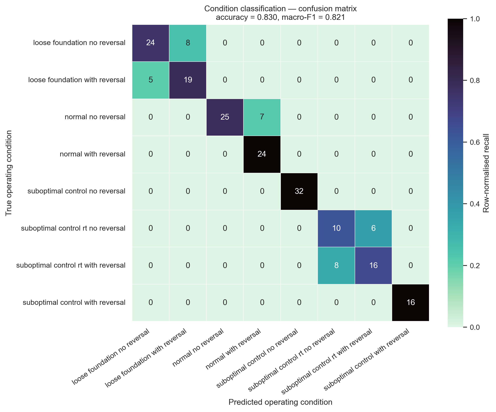
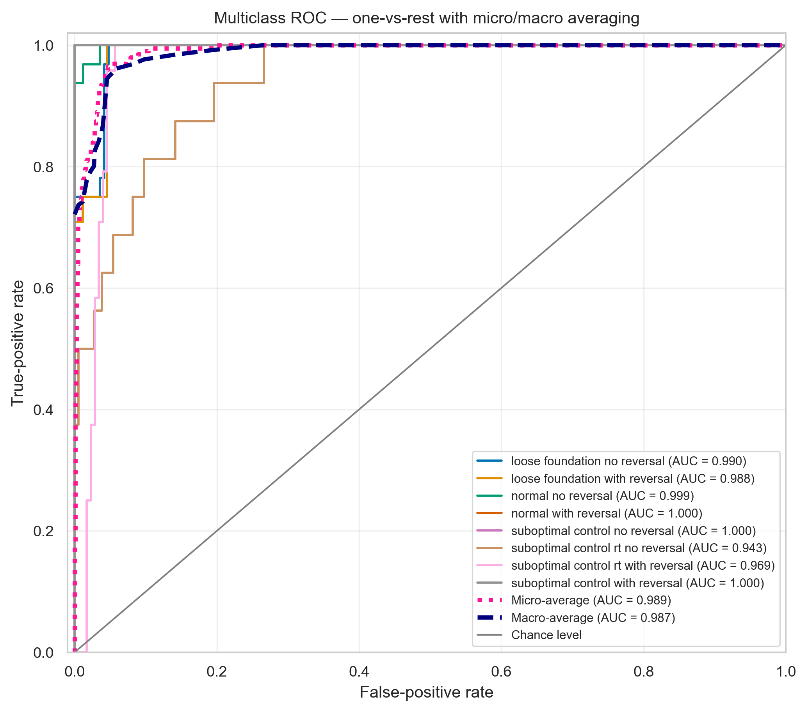
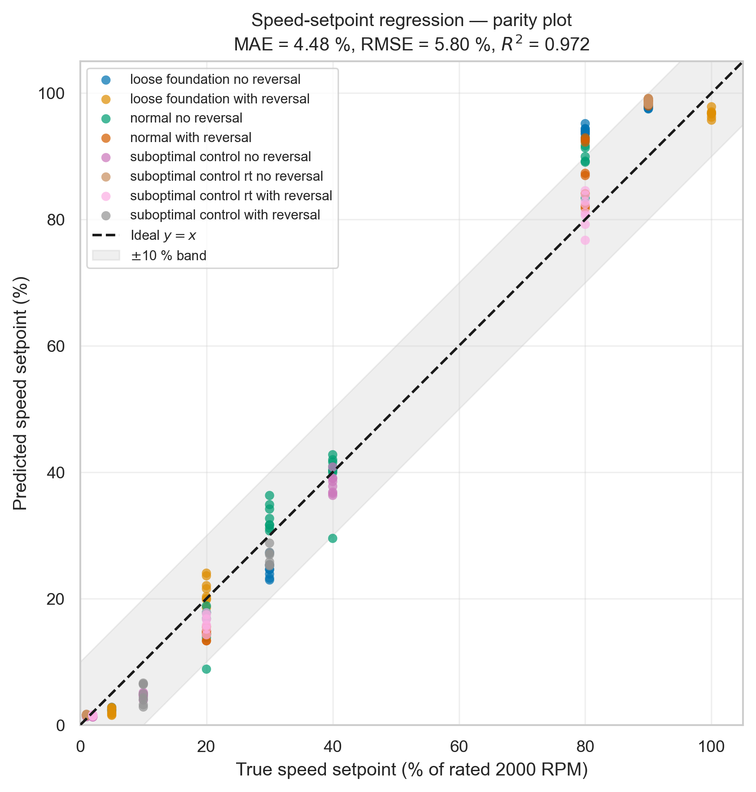
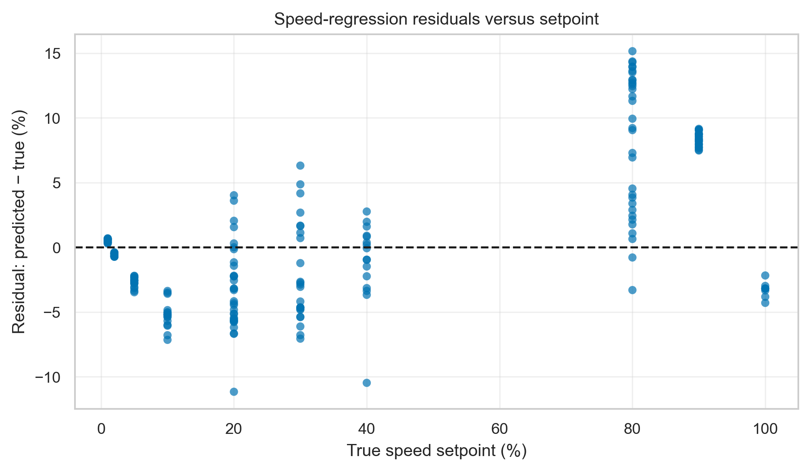
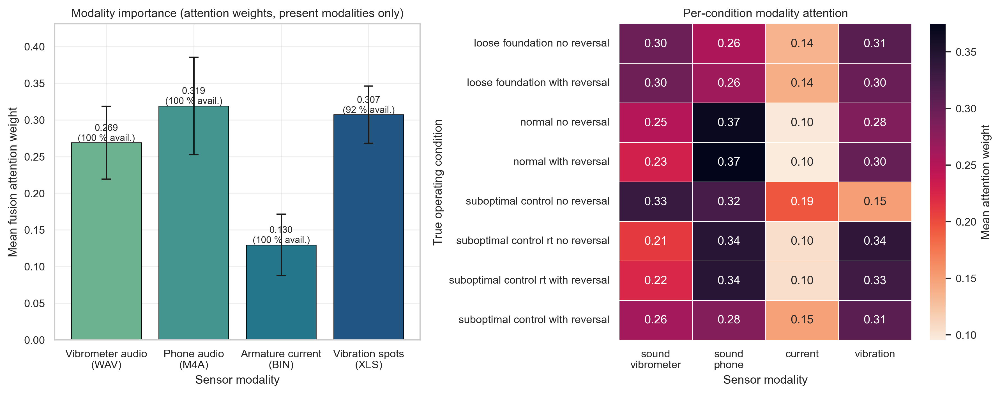
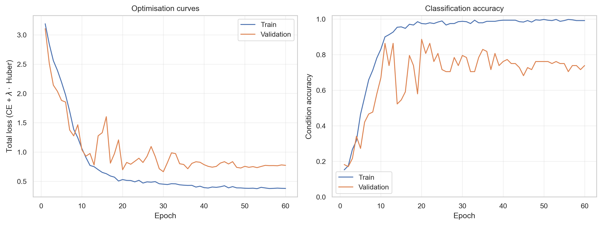

# Attention-Fused Multi-Sensor Learning for Joint Condition Diagnosis and Speed-Setpoint Estimation in a Brushed DC Servo Drive

**Draft — v0.1**
*Authors: TODO*
*Affiliation: Technical University TODO*
*Corresponding author: TODO*

---

## Abstract

Condition monitoring of brushed DC servo drives traditionally relies on invasive or
specialised instrumentation — current probes clamped inside the drive cabinet, or
contact accelerometers bolted to the machine frame. We investigate whether a
consumer smartphone microphone can carry comparable diagnostic information, and
whether heterogeneous sensors can be combined into a single model that solves two
tasks at once. We present a modular multi-modal neural pipeline that ingests four
sensing modalities recorded on a 625 W brushed permanent-magnet DC servo motor
(3PI12.12) driven by a four-quadrant thyristor converter: the AC output of an
AV-160B vibrometer probe (44.1 kHz WAV), a budget Android phone microphone at
≈1 m (lossy AAC), the armature current captured by a Rigol MSO5074 oscilloscope
(8-bit native binary), and ISO 2954 vibrometer spot readings (tabular). Modality-specific
encoders (2-D CNNs on log-Mel spectrograms, a 1-D CNN on the log Welch spectrum of the
current, and an MLP on the tabular readings) are combined by a **masked gated-attention
fusion** layer that excludes absent sensors from the attention softmax, so incomplete
sensor sets are handled natively rather than by zero-padding. Two heads predict the
operating condition (8 classes) and the commanded speed setpoint (1–100 % of rated
speed). On a strictly recording-disjoint test split (25 recordings, 200 one-second
windows) the model reaches **83.0 % accuracy**, **0.821 macro-F1** and **0.986 macro
one-vs-rest AUC** for condition classification, and **MAE = 4.48 %**,
**RMSE = 5.80 %**, **R² = 0.972** for speed regression. Every single classification
error lies *within* a condition family: the mechanical/control state (normal, loose
foundation, suboptimal speed-regulator gain, suboptimal speed + current-regulator gain)
is identified with **100 % accuracy**, and only the direction-reversal flag is
confused. The learned attention weights rank the phone microphone (0.32) on par with
the instrument-grade vibrometer (0.27) and the tabular spot readings (0.31), and well
above the armature current (0.13), supporting the hypothesis that ordinary smartphone
audio is a viable low-cost surrogate for invasive diagnostic hardware.

**Keywords:** condition monitoring, DC servo drive, multi-modal fusion, attention,
smartphone acoustics, motor current signature analysis, multi-task learning.

---

## 1. Introduction

Brushed DC servo drives remain widespread in machine tools, laboratory rigs and legacy
industrial automation, where commutator wear, mounting looseness and detuned regulator
gains all degrade performance long before an outright failure occurs. Detecting these
states normally requires either intrusive electrical access (current probes on the
armature circuit) or specialised mechanical instrumentation (contact accelerometers,
portable vibrometers). Both raise cost and commissioning effort, which limits deployment
to critical assets only.

Two trends motivate this work. First, virtually every maintenance technician now carries
a smartphone whose microphone, although lossy and uncalibrated, samples the same acoustic
field that a vibration analyst listens to. Second, modern multi-modal learning makes it
practical to fuse sensors of radically different sampling rate, dimensionality and
availability inside one model. This paper combines the two questions:

1. **Can a heterogeneous sensor set be fused into a single model that simultaneously
   classifies the operating condition and regresses the speed setpoint?**
2. **How much does a consumer smartphone microphone contribute relative to
   instrument-grade sensors, when the model itself is allowed to weight the modalities?**

Our contributions are:

- A reproducible, end-to-end pipeline (data loading → feature extraction → fusion model →
  scientific evaluation) for a publicly released multi-sensor DC servo-drive dataset,
  including a from-scratch parser for the Rigol native binary waveform format.
- A **masked gated-attention fusion** architecture that handles missing modalities without
  imputation and yields directly interpretable per-modality importance weights.
- A dual-task evaluation under a **recording-disjoint** protocol, together with an error
  analysis showing that residual confusion is confined to the direction-reversal flag.

> **TODO (draft):** expand Section 1 with a literature review of motor current signature
> analysis (MCSA), acoustic condition monitoring and multi-modal fusion for PHM; add
> 20–30 references and position the contribution against them.

---

## 2. Experimental data

We use the multi-sensor condition-monitoring dataset of a brushed permanent-magnet DC
servo motor described in [1]. The machine under test is a 3PI12.12 servo motor
(625 W, 110 V DC, 12.5 A, 5.4 N·m, 2000 rpm rated) driven by a four-quadrant thyristor
(SCR) converter with armature voltage/current control. The motor runs **unloaded**, so
each speed setpoint is a commanded speed, not a load level. The armature current is
unipolar DC plus ripple; the prominent 300 Hz component is the six-pulse converter ripple
(6 × 50 Hz) — a drive signature, not a fault.

### 2.1 Operating conditions and setpoints

Eight condition folders are formed by crossing four mechanical/control states with the
direction-reversal regime:

| Condition family | No reversal | With reversal |
|---|---|---|
| Normal operation | ✓ | ✓ |
| Loose foundation | ✓ | ✓ |
| Suboptimal control (detuned speed-regulator gain) | ✓ | ✓ |
| Suboptimal control RT (detuned speed **and** current-regulator gains) | ✓ | ✓ |

Each condition was recorded at up to 13 setpoints (1, 2, 5, 10, 20, 30, 40, 50, 60, 70,
80, 90, 100 % of rated speed). The `suboptimal_control_*` conditions stop at ≈65 %,
because above that the detuned controller trips the DC-link protection — an inherent
coverage limitation of the dataset, and a source of class imbalance in our experiments.

### 2.2 Sensor modalities

| Modality | Format | Front end used here | Notes |
|---|---|---|---|
| `sound_vibrometer` | WAV, 44.1 kHz, 16-bit stereo, ≈20.5 s | log-Mel spectrogram | AC output of the AV-160B piezoelectric probe; lossless, treated as the reference vibration waveform |
| `sound_phone` | M4A (AAC, lossy) | log-Mel spectrogram | Budget Android microphone at ≈1 m |
| `current` | Rigol MSO5074 native binary, 1 MS/s, 8-bit | log Welch PSD | Armature current; sample rate and scaling read from the file header |
| `vibration` | XLS | tabular descriptor vector | AV-160B spot readings (velocity mm/s, acceleration m/s², displacement mm) per ISO 2954 |

**Sensors were recorded sequentially, not simultaneously**, under nominally identical
operating states. Alignment is therefore *state-level*, on the key
`(condition, speed_percent)` — not sample-level. This is a deliberate property of the
dataset and constrains the fusion model to exploit stationary spectral signatures rather
than cross-modal phase relationships.

---

## 3. Method

The pipeline is implemented in a single reproducible module,
`pipeline/multimodal_pipeline.py` (PyTorch, scikit-learn, librosa, soundfile, PyAV,
Matplotlib, seaborn), with four stages: cache construction, training, inference and
scientific evaluation.

### 3.1 Sample construction and windowing

`metadata.csv` is grouped by `(condition, speed_percent)`; each group defines one
*recording state* and yields one aligned four-modality sample. To obtain a usable number
of training examples from 98 recording states, each waveform capture is decoded once over
a 17 s usable span (the first 1 s is discarded as a start-up transient) and sliced into
$N_w = 8$ non-overlapping 1 s windows. The tabular spot readings are per-recording and are
replicated across the windows of that recording. This gives **784 four-modality samples**
over **98 recordings**.

A binary availability mask $m \in \{0,1\}^4$ accompanies every sample. Observed coverage:

| Modality | Coverage |
|---|---|
| `sound_vibrometer` | 100.0 % |
| `sound_phone` | 100.0 % |
| `current` | 99.6 % |
| `vibration` | 92.9 % |

Missing modalities arise from genuine gaps in the dataset (e.g. spot readings are not
recorded at the lowest setpoints) and are propagated to the model through the mask.

### 3.2 Modality-specific front ends

- **Audio (both microphones).** Decoded to mono at 16 kHz; the phone AAC stream is decoded
  with PyAV because current `libsndfile`/`librosa` builds have no AAC decoder. A log-Mel
  spectrogram is computed with $n_\text{FFT}=1024$, hop 256 and 64 Mel bands, converted to
  dB relative to the window maximum, and standardised per sample to a $64 \times 64$ image.
- **Armature current.** The Rigol binary is parsed directly: file header → waveform header
  (x-increment, i.e. $1/f_s$) → buffer header (bytes-per-point, buffer size) → raw ADC
  payload. Only the requested byte range is read, so 80 MB captures never enter memory in
  full. The 8-bit unipolar codes are DC-removed, decimated to 50 kHz, and reduced to a
  512-bin log Welch power spectral density over 0–5 kHz (standardised with training-split
  statistics).
- **Vibration spot readings.** For each ISO 2954 metric (velocity, acceleration,
  displacement) the mean, standard deviation, minimum and maximum are taken, giving a
  12-dimensional standardised vector.

### 3.3 Encoders, fusion and heads

Each modality $i$ is embedded into a common $d = 128$ space:

| Encoder | Architecture | Parameters |
|---|---|---|
| Vibrometer Mel CNN | 4 × (Conv2d 3×3 → BN → GELU → MaxPool2d) → GAP → FC | 257 120 |
| Phone Mel CNN | identical topology, separate weights | 257 120 |
| Current spectrum CNN | 3 × (Conv1d k=7 → BN → GELU → MaxPool1d) → GAP → FC | 88 864 |
| Vibration MLP | FC-64 → BN → GELU → Dropout → FC-128 | 9 280 |
| Gated-attention fusion | $\mathbf{w}^\top(\tanh(V\mathbf{h}) \odot \sigma(U\mathbf{h}))$ | 16 577 |
| Shared trunk + two heads | LayerNorm → FC → GELU → Dropout → {FC-8, FC-1} | 17 929 |
| **Total** | | **647 402** |

A learned modality embedding is added to each token before fusion. Absent modalities are
zeroed and receive $-\infty$ attention logits, so the softmax normalises only over the
sensors that are actually present:

$$
\alpha_i = \frac{\exp(s_i)\,m_i}{\sum_j \exp(s_j)\,m_j}, \qquad
\mathbf{z} = \sum_i \alpha_i \mathbf{h}_i .
$$

This gated-attention pooling follows the attention-based multiple-instance learning
formulation of Ilse et al. [2], applied here across sensors rather than instances. The
weights $\alpha_i$ are read out at inference time as a per-sample modality-importance
score.

The fused embedding feeds a shared trunk and two heads: a linear classifier over the
8 conditions, and a sigmoid regressor on the normalised setpoint
$\tilde{y} = (y - 1)/99$.

### 3.4 Training objective and protocol

$$
\mathcal{L} = \mathrm{CE}_{\text{ls}=0.05}(\hat{\mathbf{p}}, y_{\text{cls}})
            + \lambda \, \mathrm{Huber}_{\beta=0.05}(\hat{\tilde y}, \tilde y), \quad \lambda = 5 .
$$

Training uses AdamW (lr $10^{-3}$, weight decay $10^{-4}$), OneCycle scheduling, batch
size 32, 60 epochs, gradient-norm clipping at 5, dropout 0.3, and **modality dropout**
(p = 0.15, never dropping all modalities) so the fusion layer cannot collapse onto a
single sensor. The checkpoint with the lowest validation loss is retained.

**Splitting.** Because windows cut from the same 20 s capture are strongly correlated,
splits are made with `GroupShuffleSplit` over the `(condition, speed_percent)` recording
key, so no recording contributes to more than one split:

| Split | Windows | Recordings |
|---|---|---|
| Train | 496 | 62 |
| Validation | 88 | 11 |
| Test | 200 | 25 |

This is a deliberately strict protocol: at test time the model sees setpoints of a
condition it never observed during training, so the reported speed regression is genuine
interpolation across unseen operating points rather than window-level memorisation. The
held-out split covers the setpoints {1, 2, 5, 10, 20, 30, 40, 80, 90, 100} %; the
50–70 % range falls entirely in train/validation, which explains the gap in Figure 3.

---

## 4. Results

All figures are generated automatically by the evaluation stage at 300 dpi
(`pipeline_outputs/multimodal/figures/`), and all numbers below are read from
`pipeline_outputs/multimodal/metrics.json`.

### 4.1 Condition classification

| Metric | Value |
|---|---|
| Accuracy | 0.830 |
| Balanced accuracy | 0.827 |
| Macro-F1 | 0.821 |
| Weighted F1 | 0.831 |
| ROC-AUC (OvR, macro) | 0.986 |
| ROC-AUC (micro) | 0.989 |



**Figure 1.** Row-normalised confusion matrix over the 200 held-out windows; annotations
are raw counts.

Per-class performance:

| Class | Precision | Recall | F1 | Support |
|---|---|---|---|---|
| loose_foundation_no_reversal | 0.83 | 0.75 | 0.79 | 32 |
| loose_foundation_with_reversal | 0.70 | 0.79 | 0.75 | 24 |
| normal_no_reversal | 1.00 | 0.78 | 0.88 | 32 |
| normal_with_reversal | 0.77 | 1.00 | 0.87 | 24 |
| suboptimal_control_no_reversal | 1.00 | 1.00 | 1.00 | 32 |
| suboptimal_control_rt_no_reversal | 0.56 | 0.63 | 0.59 | 16 |
| suboptimal_control_rt_with_reversal | 0.73 | 0.67 | 0.70 | 24 |
| suboptimal_control_with_reversal | 1.00 | 1.00 | 1.00 | 16 |

**The error structure is highly informative.** All 34 misclassifications are
*within-family*: `loose ↔ loose`, `normal ↔ normal`, `suboptimal_rt ↔ suboptimal_rt`.
Collapsing the labels to the four mechanical/control families gives **100.0 % accuracy**,
while the binary reversal flag is recovered at 83.0 %. In other words, the pipeline
diagnoses *what is wrong with the machine* perfectly on this test split, and only fails to
decide whether the drive was periodically reversing — an operating regime, not a fault.



**Figure 2.** One-vs-rest ROC curves with micro- and macro-averaging. The high AUC
(0.986 macro) relative to accuracy indicates well-ranked posteriors: the correct class is
almost always among the top scores even when the arg-max is wrong.

### 4.2 Speed-setpoint regression

| Metric | Value |
|---|---|
| MAE | 4.48 % of rated speed |
| Median absolute error | 3.38 % |
| RMSE | 5.80 % |
| $R^2$ | 0.972 |



**Figure 3.** True versus predicted speed setpoint with the ideal $y = x$ reference and a
±10 % band, coloured by true condition.



**Figure 4.** Residuals versus setpoint.

Error is strongly setpoint-dependent: MAE is **2.25 %** for setpoints ≤ 10 % and
**5.53 %** above 10 %. In absolute terms the low-speed regime is therefore the more
accurate one, which is consistent with the acoustic and current signatures changing
rapidly (and hence being more discriminative) at low commanded speed, while the
high-speed captures are spectrally more similar to one another.

### 4.3 Modality importance



**Figure 5.** Left: mean fusion attention weight per modality (± s.d., computed only over
samples where the modality is present). Right: mean attention per true condition.

| Modality | Mean attention | s.d. | Availability |
|---|---|---|---|
| `sound_phone` | 0.319 | 0.067 | 100 % |
| `vibration` (spot readings) | 0.307 | 0.039 | 92 % |
| `sound_vibrometer` | 0.269 | 0.050 | 100 % |
| `current` | 0.130 | 0.042 | 100 % |

The smartphone microphone receives the **largest** average attention weight — slightly
above the instrument-grade vibrometer waveform — while the armature current receives less
than half as much. This is the central practical result: under this fusion model, a
≈1 m consumer microphone is not a degraded afterthought but a first-class information
source for both tasks. We caution that attention weights are a model-internal saliency
measure, not a causal ablation (see Section 5.2).

### 4.4 Optimisation behaviour



**Figure 6.** Training and validation loss and accuracy. Training accuracy saturates near
0.99 while validation accuracy oscillates between 0.68 and 0.89, indicating that with only
62 training recordings the model is capacity-limited by data, not by parameters.

---

## 5. Discussion

### 5.1 Interpretation

Three findings stand out. (i) The four condition families are perfectly separable on
held-out recordings, so the acoustic/vibration signature of a loosened foundation and of a
detuned regulator is unambiguous even at one-second granularity. (ii) The residual
confusion is entirely about direction reversal — plausible, since a periodically reversing
drive spends most of its time in steady rotation, and a randomly positioned 1 s window may
contain no reversal event at all. Window length is therefore a natural lever: longer
windows (or explicit reversal-event detection) should recover this factor. (iii) Speed can
be regressed to ≈4.5 % of rated speed from sensors that were never synchronised with one
another, confirming that state-level alignment is sufficient for stationary signatures.

### 5.2 Limitations

- **Scale.** 98 recordings and 784 windows is small; the validation curve is noisy and the
  single train/val/test split gives wide effective confidence intervals. Repeated
  group-stratified cross-validation is required before the numbers can be quoted as
  point estimates.
- **Attention ≠ causal importance.** Section 4.3 reports internal weights. A leave-one-
  modality-out ablation (and a phone-only model) is needed to substantiate the
  "phone can replace the probe" claim quantitatively.
- **Sequential recording.** Modalities are aligned by operating state, not in time; any
  drift between recordings of the same state is unmodelled noise.
- **Coverage imbalance.** `suboptimal_control_*` is capped at ≈65 % of rated speed, so
  condition and speed are not fully crossed; part of the classification signal may be a
  speed-range prior rather than a condition signature.
- **Single machine.** All data come from one motor and one rig; cross-machine
  generalisation is untested.

### 5.3 Planned extensions

> **TODO (draft):** the following experiments are required for a submittable version.

1. Unimodal baselines (phone-only, vibrometer-only, current-only, vibration-only) and
   leave-one-modality-out ablations, with the identical protocol.
2. Repeated `GroupKFold` cross-validation with mean ± s.d. for every metric.
3. Comparison against classical baselines: hand-crafted spectral features + gradient
   boosting; MCSA band-power features.
4. Window-length sweep (1 s / 2 s / 5 s) targeting the reversal-flag confusion.
5. Alternative fusion strategies (late logit averaging, cross-modal transformer) as an
   architecture ablation.
6. Robustness study: additive background noise and microphone-distance variation for the
   phone modality.

---

## 6. Reproducibility

```bash
python pipeline/multimodal_pipeline.py --stage all --epochs 60
```

Stages can be run separately (`--stage cache|train|eval`). The run produces:

```
pipeline_outputs/multimodal/
  feature_cache.npz          # 784 aligned four-modality samples + masks + labels
  model.pt                   # weights, normalisation statistics, split indices
  metrics.json               # all reported metrics
  training_history.csv
  figures/                   # Figures 1-6, PNG (300 dpi) + PDF
  tables/classification_report.csv, test_predictions.csv
```

Environment: Python 3.13, PyTorch 2.13 (CPU), librosa 1.0, soundfile, PyAV 18.1,
scikit-learn, seaborn 0.13. Seed 1337 for splits and initialisation; results in Section 4
were obtained on CPU in a single run.

---

## 7. Conclusion

We presented an attention-fused multi-modal pipeline that jointly diagnoses the operating
condition and estimates the speed setpoint of a brushed DC servo drive from four
heterogeneous sensors. Under a strict recording-disjoint protocol the model attains
0.830 accuracy / 0.986 macro AUC on eight classes and $R^2 = 0.972$ on speed, with every
classification error confined to the direction-reversal flag — the four mechanical and
control condition families are separated without error. The fusion layer assigns the
highest attention weight to a budget smartphone microphone, ahead of an instrument-grade
vibrometer waveform and far ahead of the armature current, providing model-internal
evidence that low-cost acoustic sensing is a credible substitute for invasive
instrumentation in this class of machine. Confirming that evidence with explicit
modality ablations, cross-validated estimates and cross-machine data is the subject of
ongoing work.

---

## References

> **TODO (draft):** complete and format for the target venue; items below are placeholders
> except where noted.

[1] *Multi-Sensor Condition-Monitoring Dataset of a Brushed DC Servo Motor*, Mendeley
Data, CC BY 4.0. TODO: authors, DOI, year.

[2] M. Ilse, J. M. Tomczak, M. Welling, "Attention-based Deep Multiple Instance
Learning", *ICML*, 2018.

[3] TODO — survey of motor current signature analysis for fault diagnosis.

[4] TODO — acoustic-based machine condition monitoring with deep learning.

[5] TODO — multi-modal fusion for prognostics and health management.
